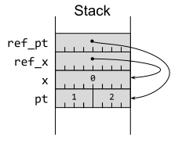
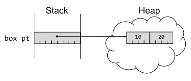
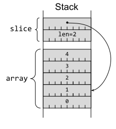
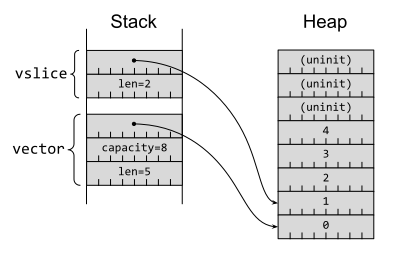
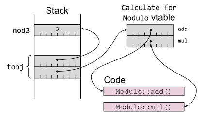
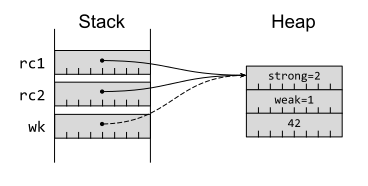
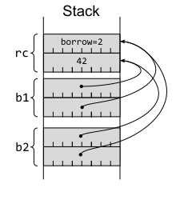

# 第 8 条：熟悉引用和指针类型

在一般的编程中，**引用（reference）** 是一种间接访问数据结构的方式，它与拥有该数据结构的变量是分开的。在实践中，*引用* 通常由 **指针（pointer）** 来实现。*指针* 是一个数字，它的值是数据结构在内存中的地址。

现代 CPU 通常会对指针施加一些限制：内存地址应该处于有效的内存范围内（虚拟内存或物理内存），并且可能需要对齐（例如，一个 4 字节的整数值可能只有在其地址是 4 的倍数时才能访问）。

然而，高级编程语言通常会在其类型系统中编码更多关于指针的信息。在 C 衍生的语言（包括 Rust）中，指针中有一个类型，该类型表示期望在所指向的内存地址存储哪种类型数据结构。这允许通过代码解释在该地址以及随后内存中的内容。

这种基本的指针信息 —— 假定的内存位置和预期的数据结构布局 —— 在 Rust 中被表示为一个**裸指针（raw pointer）**。然而，安全的 Rust 代码不使用裸指针，因为 Rust 提供了更丰富的引用和指针类型，这些类型提供了额外的安全保证和约束。这些引用和指针类型是本节的主题；裸指针则留待[第 16 条]讨论（该节讨论 unsafe 代码）。

## Rust引用

在 Rust 中，最常见的指针类型是 *引用*，用 `&T` 表示，其中 `T` 是任意类型。尽管在底层这是一个指针值，但编译器会确保在使用时遵循一些规则：
- 始终指向有效且正确对齐的类型 `T` 的实例。
- 被引用数据的生命周期（在[第 14 条]中介绍）必须比 *引用* 本身的生命周期更长。
- 遵守借用检查规则（在[第 15 条]中解释）。

这些额外的约束总是隐含在 Rust 中的 *引用* 中，因此 *裸指针* 通常很少出现。

Rust 引用必须指向有效、正确对齐的项的约束，与 C++ 的引用类型相同。然而，C++ 没有生命周期的概念，因此允许使用悬空引用而导致错误[^1]：

<div class="ferris"></div>

```c++
// C++
const int& dangle() {
  int x = 32; // on the stack, overwritten later
  return x; // return reference to stack variable!
}
```

Rust 的借用和生命周期检查会让等价的代码甚至不能编译:

```rust
fn dangle() -> &'static i64 {
    let x: i64 = 32; // 在栈上
    &x
}
```
```error
error[E0515]: cannot return reference to local variable `x`
   --> src/main.rs:477:5
    |
477 |     &x
    |     ^^ returns a reference to data owned by the current function
```

Rust 的引用 `&T` 允许只读访问底层项（大致相当于 C++ 的`const T&`）。一个允许修改底层项的可变引用写为 `&mut T`，同样也遵循[第 15 条]讨论的借用检查规则。这种命名方式反映了 Rust 和 C++ 之间略微不同的思维方式：
- 在 Rust 中，默认情况下变量是只读的，可写类型需要特别标记（用 `mut`）。
- 在 C++ 中，默认情况下变量是可写的，只读类型需要特别标记（用 `const`）。

编译器会将使用引用的 Rust 代码转换为使用简单指针的机器码，在 64 位平台上这些指针的长度为 8 个字节（本节将一直如此假设）。

例如，一对局部变量以及对它们的引用：

```rust
pub struct Point {
    pub x: u32,
    pub y: u32,
}

let pt = Point { x: 1, y: 2 };
let x = 0u64;
let ref_x = &x;
let ref_pt = &pt;
```

可能最终在栈上布局如图1-2所示。



图1-2.带有指向局部变量的指针的栈布局

Rust 引用可以指向位于**栈**或**堆**上的项。Rust 默认情况下会在栈上分配内存，但是 `Box<T>` 指针类型（大致相当于 C++ 的 `std::unique_ptr<T>`）会强制分配到堆上，这意味着分配的项可以比当前代码块的作用域更长寿。本质上，`Box<T>` 也是一个简单的 8 字节指针值（64 位平台）：

```rust
let box_pt = Box::new(Point { x: 10, y: 20 });
```

这在图1-3中被描述。



图1-3.栈上的 `Box` 指针指向堆上的 `struct`

## 指针 `trait`

期望一个引用参数如 `&Point` 的方法也可以接受一个 `&Box<Point>`：

```rust
fn show(pt: &Point) {
    println!("({}, {})", pt.x, pt.y);
}
show(ref_pt);
show(&box_pt);
```

```shell
(1, 2)
(10, 20)
```

这之所以可能，是因为 `Box<T>` 实现了 `Target = T` 的 [`Deref`] `trait`。某个类型实现这个 `trait` 意味着该 `trait` 的 [`deref()`] 方法可以用于创建对 `Target` 类型的引用。还有一个等效的 [`DerefMut`] `trait`，它会生成对 `Target` 类型的**可变**引用。

`Deref`/`DerefMut` `trait` 有点特别，因为 Rust 编译器在处理实现它们的类型时有特定的行为。当编译器遇到解引用表达式（例如，[`*x`]），它会根据解引用是否需要可变访问来查找并使用这些 `trait` 的实现。这种 `Deref` 转换允许各种智能指针类型像普通引用一样工作，它是 Rust 中少数允许隐式类型转换的机制之一（如[第 5 条]所述）。

作为一个技术细节，值得理解为什么 `Deref` `trait` 的目标类型不能是泛型的（`Deref<Target>`）。如果可以是泛型的，那么某个 `ConfusedPtr` 类型就可以同时实现 `Deref<TypeA>` 和 `Deref<TypeB>`，这将使编译器无法为 `*x` 这样的表达式推导出唯一的类型。因此，目标类型被编码为一个名为 `Target` 的关联类型。

这个技术细节与另外两个标准指针 `trait` [`AsRef`] 和 [`AsMut`] 形成了对比。这些 `trait` 不会在编译器中引起特殊行为，但允许通过对其 `trait` 函数（[`as_ref()`] 和 [`as_mut()`]）的显式调用进行引用或可变引用的转换。转换的目标类型被编码为类型参数（例如 `AsRef<Point>`），这意味着一个容器类型可以支持多个目标类型。

例如，标准 [`String`] 类型实现了 `Target = str` 的 `Deref` `trait`，这意味着像 `&my_string` 这样的表达式可以隐式类型转换为 `&str`。但它也实现了以下 `trait`：
- `AsRef<[u8]>`，允许转换为字节切片 `&[u8]`
- `AsRef<OsStr>`，允许转换为 OS 字符串
- `AsRef<Path>`，允许转换为文件系统路径
- `AsRef<str>`，允许转换为字符串切片 `&str`（与 `Deref` 相同）

## 胖指针类型

Rust 有两个内置的**胖指针**类型：切片（`Slice`）和 `trait` 对象。这些类型的行为像指针，但它们持有关于指向对象的额外信息。

### 切片

第一种胖指针类型是**切片**：它引用某个连续值集合的子集。切片由一个（没有所有权的）简单指针和一个长度字段组成，因此大小是简单指针的两倍（在 64 位平台上为 16 字节）。切片的类型写为 `&[T]` —— 它表示对 `[T]` 的引用，`[T]`是类型 T 的连续值集合的概念类型。

概念类型 `[T]` 不能被实例化，但是有两种常见的容器实现了它。第一种是**数组**：一个连续的值集合，其大小在编译时是已知的。

一个有 5 个值的数组将始终有 5 个值。因此，切片可以引用数组的一个子集（如图 1-4 所示）：

```rust
let array: [u64; 5] = [0, 1, 2, 3, 4];
let slice = &array[1..3];
```



图1-4.指向栈数组的栈切片

连续值的另一种常见容器是 `Vec<T>`。这像数组一样持有连续的值集合，但与数组不同，`Vec` 中的值的数量可以增长（例如用 [`push(value)`] ）或缩小（例如用 [`pop()`] ）。

`Vec` 的内容保存在堆上（这允许其大小发生变化），并且总是连续的，因此切片可以引用 `Vec` 的子集，如图 1-5 所示：

```rust
let mut vector = Vec::<u64>::with_capacity(8);
for i in 0..5 {
    vector.push(i);
}
let vslice = &vector[1..3];
```



图1-5.指向堆上的Vec内容的栈切片

表达式 `&vector[1..3]` 的底层有很多细节，所以值得将其进行逐层的拆解：
- `1..3` 部分是一个[范围表达式(range expression)]；编译器会将其转换为 [`Range<usize>`] 类型的实例，该类型包含下限（1）但不包含上限（3）。
- `Range` 类型[实现了] [`SliceIndex<T>`] `trait`，该 `trait` 描述了对任意类型 `T` 的切片的索引操作（因此其 `Output` 类型为`[T]`）。
- `vector[]` 部分是一个[索引表达式(indexing expression)]；编译器将其转换为在 `vector` 上调用 [`Index`] `trait` 的 [`index`] 方法，并附加一次解引用（即 `*vector.index()` ）。[^2]
- `vector[1..3]` 会调用 `Vec<T>` 的 `Index<I>` [实现]，它要求 `I` 是 `SliceIndex<[u64]>` 的一个实例。这是因为 `Range<usize>` 对于任何 `T` 类型来说，包括 `u64`，都实现了 `SliceIndex<[T]>` `trait`。
- `&vector[1..3]` 取消了解引用，最终得到的表达式类型为 `&[u64]`。

### `trait` 对象

第二种内置的胖指针类型是 `trait` 对象：它是一个实现了特定 `trait` 的项的引用。`trait` 对象由一个指向该项的简单指针和一个指向类型 [`vtable`] 的内部指针共同构成，大小为 16 字节（在 64 位平台上）。类型的 `vtable` 存储了该类型所实现 `trait` 的方法实现的函数指针，从而允许在运行时进行动态分派（[第 12 条]）。[^3]

例如，定义一个简单的 `trait`：

```rust
trait Calculate {
    fn add(&self, l: u64, r: u64) -> u64;
    fn mul(&self, l: u64, r: u64) -> u64;
}
```

以及一个实现该 `trait` 的结构体：

```rust
struct Modulo(pub u64);

impl Calculate for Modulo {
    fn add(&self, l: u64, r: u64) -> u64 {
        (l + r) % self.0
    }
    fn mul(&self, l: u64, r: u64) -> u64 {
        (l * r) % self.0
    }
}

let mod3 = Modulo(3);
```

我们可以将 `Modulo` 转换为 `trait` 对象 `&dyn` `Calculate`。[`dyn`] 关键字强调了涉及动态分派的事实：

```rust
// Need an explicit type to force dynamic dispatch.
let tobj: &dyn Calculate = &mod3;
let result = tobj.add(2, 2);
assert_eq!(result, 1);
```

相应的内存布局如图 1-6 所示。



图1-6.指向具体项和 `vtable` 的 `trait` 对象

持有 `trait` 对象的代码可以通过 `vtable` 中的函数指针调用 `trait` 的方法，并将项指针作为 `&self` 参数传递；有关更多信息和建议，请参考[第 12 条]。

## 更多指针 `trait`

之前的指针 `trait` 一节描述了两组 `trait`（`Deref`/`DerefMut`、`AsRef`/`AsMut`），它们用于处理可以轻松转换为引用的类型。除此之外，还有一些标准 `trait` 在处理类似指针的类型时也会发挥作用，这些类型可以来自标准库或用户自定义的类型。

其中最简单的是 [`Pointer`] `trait`，它用于格式化指针值以供输出。这对于底层开发调试很有帮助，编译器在遇到 `{:p}` 格式说明符时会自动使用这个 `trait`。

更有趣的是 [`Borrow`] 和 [`BorrowMut`] `trait`，它们各自只有一个方法（分别为 [`borrow`] 和 [`borrow_mut`]）。这些方法的签名与相应的 `AsRef`/`AsMut` `trait` 方法相同。

通过标准库提供的通用实现，可以看到这些 `trait` 之间的主要意图差异。给定任意 Rust 引用 `&T`，标准库都提供了 `AsRef` 和 `Borrow` 的通用实现；同样地，对于可变引用 `&mut T`，也提供了 `AsMut` 和 `BorrowMut` 的通用实现。

然而，`Borrow` 还有一个针对（非引用）类型的通用实现：`impl<T> Borrow<T> for T`。这意味着，一个接受 `Borrow` `trait` 的方法可以同样处理 `T` 的实例以及对 `T` 的引用：

```rust
fn add_four<T: std::borrow::Borrow<i32>>(v: T) -> i32 {
    v.borrow() + 4
}
assert_eq!(add_four(&2), 6);
assert_eq!(add_four(2), 6);
```

标准库的容器类型有更贴合实际的 `Borrow` 用法。例如，[`HashMap::get`] 使用 `Borrow` 以便无论通过值还是引用作为键，都可以方便地检索条目。

[`ToOwned`] `trait` 建立在 `Borrow` `trait` 的基础上，增加了一个 [`to_owned()`] 方法，该方法生成一个新的底层类型的拥有项。这是 `Clone` `trait` 的泛化: `Clone` `trait` 特别要求一个 Rust 引用 `&T`，而 `ToOwned` 则处理实现 `Borrow` 的内容。

这为以统一的方式处理引用和移动项提供了几种可能性：
- 一个操作某些类型引用的函数可以接受 `Borrow`，以便它也可以用移动项调用。
- 一个操作某些类型拥有项的函数可以接受 `ToOwned`，以便它也可以用引用项调用；传递给它的任何引用都将被复制到本地拥有项中。

此时值得一提的是 [`Cow`] 类型，虽然它不是指针类型，但它提供了处理相同情况的替代方式。`Cow` 是一个枚举，可以持有拥有的数据或对借用数据的引用。这个特殊的名称代表“写入时复制”（clone-on-write）：一个 `Cow` 输入可以作为借用数据一直保持，直到它需要被修改，但在数据需要被更改的时，它才会变成一个拥有的副本。

## 智能指针类型

Rust 标准库包含多种在某种程度上类似于指针的类型，这些类型在一定程度上充当指针的角色，并由之前描述的标准库 `trait` 进行协调。每种智能指针类型都具有一些特定的语义和保证，正确组合它们可以对指针的行为进行细粒度控制，但缺点是由此产生的类型乍一看可能会让人不知所措（比如 `Rc<RefCell<Vec<T>>>`）。

第一个智能指针类型是 [`Rc<T>`]，它是对某个项的引用计数指针（大致类似于 C++ 中的 [`std::shared_ptr<T>`]）。它实现了所有与指针相关的 `trait`，因此在许多方面的行为类似于 `Box<T>`。

这对于可以通过不同途径访问同一个项的数据结构很有用，但它消除了 Rust 围绕所有权的核心规则之一 —— 每个项只有一个所有者。放宽这条规则意味着现在可能会发生数据泄漏：如果变量 A 有一个指向变量 B 的 `Rc` 指针，而变量 B 有一个指向 A 的 `Rc` 指针，那么这对变量将永远不会被释放。[^4]换句话说：你需要 `Rc` 来支持环形数据结构，但缺点是现在你的数据结构中存在环。

在某些情况下，可以通过使用相关的 [`Weak<T>`] 类型来降低数据泄漏的风险。`Weak<T>` 持有对底层数据的非所有权引用（弱引用，类似于 C++ 的 [`std::weak_ptr<T>`]）。持有弱引用不会阻止底层数据被删除（当所有强引用都被移除时），所以使用 `Weak<T>` 时会涉及到升级为 `Rc<T>` —— 这个操作可能会失败。

在底层，`Rc`（目前）实现为一对引用计数和被引用的项，所有这些都存储在堆上（如图 1-7 所示）：

```rust
use std::rc::Rc;
let rc1: Rc<u64> = Rc::new(42);
let rc2 = rc1.clone();
let wk = Rc::downgrade(&rc1);
```



图1-7. `Rc` 和 `Weak` 指针都指向堆上同一个项

当强引用计数降至零时，底层数据将被释放，但只有弱引用计数也降至零时，才会释放登记计数的结构。

`Rc<T>` 本身允许你以不同的方式访问一个项，但是当你访问该项时，只有在没有其他方式访问该项时（即，没有其他现存的 `Rc` 或 `Weak` 引用指向同一项），你才能修改它（通过 [`get_mut`]）。这很难协调，因此 `Rc` 通常与 `RefCell` 结合使用。

下一个智能指针类型是 [`RefCell<T>`]，它放宽了只能由所有者或持有唯一可变引用的代码修改数据的规则（参考[第 15 条]）。这种内部可变性带来了更大的灵活性，例如允许 `trait` 实现修改内部，即使方法签名只允许 `&self`。然而，这也带来了代价：除了额外的存储开销（需要一个额外的 `isize` 用于跟踪当前的借用，如图 1-8 所示），正常的借用检查也从编译时转移到了运行时：

```rust
use std::cell::RefCell;
let rc: RefCell<u64> = RefCell::new(42);
let b1 = rc.borrow();
let b2 = rc.borrow(); 
```



图1-8. 指向 `RefCell` 容器的 `Ref` 借用

这些运行时的借用检查意味着用户使用 `RefCell` 时，必须在两个不愉快的选项之间做出选择：

- 接受借用可能失败的操作，并处理来自 `try_borrow[_mut]` 的 `Result` 值。
- 使用所谓不会失败的借用方法 `borrow[_mut]`，并接受在运行时由于借用规则不合规而引发 `panic!` 的风险（参考[第 18 条]）。

无论哪种情况，这种运行时检查意味着 `RefCell` 没有实现任何标准指针 `trait`；相反，它的访问操作返回一个实现了这些 `trait` 的 [`Ref<T>`] 或 [`RefMut<T>`] 智能指针类型。

如果底层类型 `T` 实现了 `Copy` `trait`（表示按位快速复制生成一个有效的项；参考[第 10 条]），那么 `Cell<T>` 类型允许以更少的开销进行内部修改 —— 用 `get(&self)` 方法复制出当前值，用 `set(&self, val)` 方法设置一个新值进去。`Cell` 类型在 `Rc` 和 `RefCell` 实现中都被内部使用，用于共享跟踪可以修改的计数器，而无需 `&mut self`。

到目前为止描述的智能指针类型仅适用于单线程使用；它们的实现假设对其内部没有并发访问。如果不是这种情况，则需要包含额外同步开销的智能指针。

[`Arc<T>`] 是 `Rc<T>` 的线程安全实现，它使用原子计数器来确保引用计数保持准确。与 `Rc` 一样，`Arc` 实现了所有各种与指针相关的 `trait`。

然而，单独的 `Arc` 不允许对底层项目进行任何形式的可变访问。这是由 [`Mutex`] 类型引起的，它确保只有一个线程可以访问（无论是可变的还是不可变的）底层项目。与 `RefCell` 一样，`Mutex` 本身不实现任何指针 `trait`，但它的 `lock()` 操作返回一个实现了 `Deref[Mut]` 的类型的值：[`MutexGuard`]。

如果读操作线程可能多于写操作线程，则更推荐使用 [`RwLock`] 类型，因为它允许多个读操作线程并行访问底层项，前提是当前没有任何写操作线程。

在任何情况下，Rust 的借用和线程规则都强制在多线程代码中使用这些同步容器中的一个（但这仅能防止一些共享状态并发的问题；参考[第 17 条]）。

对于其他智能指针类型，有时也可以应用相同的策略 —— 查看编译器拒绝的内容，并替换为它建议的内容。然而，更快、更少挫折的方法是理解不同智能指针的行为含义。借用来自 [`Rust 编程语言第一版`]的示例:
- `Rc<RefCell<Vec<T>>>` 持有一个具有共享所有权 (`Rc`) 的 `Vec`，其中 `Vec` 可以作为一个整体被修改。
- `Rc<Vec<RefCell<T>>>` 也持有具有共享所有权的 `Vec`，但这里 `Vec` 中的每个单独的条目都可以独立于其他条目进行修改。

其中涉及到的类型精确描述了这些行为。


## 注释

[^1]: 尽管有来自现代编译器的警告

[^2]: 可变表达式的对应 `trait` 是 [`IndexMut`]

[^3]: 这是一种简化解释；完整的`虚函数表（vtable）`还包含类型的尺寸和对齐信息，以及一个 `drop()` 函数指针，用于安全地释放底层对象

[^4]: 请注意，这并不影响 Rust 的内存安全保证：项仍然是安全的，只是无法访问

原文[点这里](https://www.lurklurk.org/effective-rust/references.html)查看

<!-- 参考链接 -->

[第 5 条]: item5-casts.md
[第 10 条]: ../chapter_2/item10-std-traits.md
[第 12 条]: ../chapter_2/item12-generics&trait-objects.md
[第 14 条]: ../chapter_3/item14-lifetimes.md
[第 15 条]: ../chapter_3/item15-borrows.md
[第 16 条]: ../chapter_3/item16-unsafe.md
[第 17 条]: ../chapter_3/item17-deadlock.md
[第 18 条]: ../chapter_3/item18-panic.md

[`Deref`]: https://doc.rust-lang.org/std/ops/trait.Deref.html
[`deref()`]: https://doc.rust-lang.org/std/ops/trait.Deref.html#tymethod.deref
[`DerefMut`]: https://doc.rust-lang.org/std/ops/trait.DerefMut.html
[`*x`]: https://doc.rust-lang.org/reference/expressions/operator-expr.html#the-dereference-operator
[`AsRef`]: https://doc.rust-lang.org/std/convert/trait.AsRef.html
[`AsMut`]: https://doc.rust-lang.org/std/convert/trait.AsMut.html
[`as_ref()`]: https://doc.rust-lang.org/std/convert/trait.AsRef.html#tymethod.as_ref
[`as_mut()`]: https://doc.rust-lang.org/std/convert/trait.AsMut.html#tymethod.as_mut
[`String`]: https://doc.rust-lang.org/std/string/struct.String.html
[`push(value)`]: https://doc.rust-lang.org/std/vec/struct.Vec.html#method.push
[`pop()`]: https://doc.rust-lang.org/std/vec/struct.Vec.html#method.pop
[范围表达式(range expression)]: https://doc.rust-lang.org/reference/expressions/range-expr.html
[`Range<usize>`]: https://doc.rust-lang.org/std/ops/struct.Range.html
[实现了]: https://doc.rust-lang.org/std/ops/struct.Range.html#impl-SliceIndex%3C%5BT%5D%3E-for-Range%3Cusize%3E
[`SliceIndex<T>`]: https://doc.rust-lang.org/std/slice/trait.SliceIndex.html
[索引表达式(indexing expression)]: https://doc.rust-lang.org/reference/expressions/array-expr.html#array-and-slice-indexing-expressions
[`Index`]: https://doc.rust-lang.org/std/ops/trait.Index.html
[`index`]: https://doc.rust-lang.org/std/ops/trait.Index.html#tymethod.index
[`实现`]: https://doc.rust-lang.org/std/vec/struct.Vec.html#impl-Index%3CI%3E-for-Vec%3CT,+A%3E
[`vtable`]: https://en.wikipedia.org/wiki/Virtual_method_table
[`dyn`]: https://doc.rust-lang.org/std/keyword.dyn.html
[`Pointer`]: https://doc.rust-lang.org/std/fmt/trait.Pointer.html
[`Borrow`]: https://doc.rust-lang.org/std/borrow/trait.Borrow.html
[`BorrowMut`]: https://doc.rust-lang.org/std/borrow/trait.BorrowMut.html
[`borrow`]: https://doc.rust-lang.org/std/borrow/trait.Borrow.html#tymethod.borrow
[`borrow_mut`]: https://doc.rust-lang.org/std/borrow/trait.BorrowMut.html#tymethod.borrow_mut
[`HashMap::get`]: https://doc.rust-lang.org/std/collections/struct.HashMap.html#method.get
[`ToOwned`]: https://doc.rust-lang.org/std/borrow/trait.ToOwned.html
[`to_owned()`]: https://doc.rust-lang.org/std/borrow/trait.ToOwned.html#tymethod.to_owned
[`Cow`]: https://doc.rust-lang.org/std/borrow/enum.Cow.html
[`Rc<T>`]: https://doc.rust-lang.org/std/rc/struct.Rc.html
[`std::shared_ptr<T>`]: https://en.cppreference.com/w/cpp/memory/shared_ptr
[`Weak<T>`]: https://doc.rust-lang.org/std/rc/struct.Weak.html
[`std::weak_ptr<T>`]: https://en.cppreference.com/w/cpp/memory/weak_ptr
[`get_mut`]: https://doc.rust-lang.org/std/rc/struct.Rc.html#method.get_mut
[`RefCell<T>`]: https://doc.rust-lang.org/std/cell/struct.RefCell.html
[`Ref<T>`]: https://doc.rust-lang.org/std/cell/struct.Ref.html
[`RefMut<T>`]: https://doc.rust-lang.org/std/cell/struct.RefMut.html
[`Arc<T>`]: https://doc.rust-lang.org/std/sync/struct.Arc.html
[`Mutex`]: https://doc.rust-lang.org/std/sync/struct.Mutex.html
[`MutexGuard`]: https://doc.rust-lang.org/std/sync/struct.MutexGuard.html
[`RwLock`]: https://doc.rust-lang.org/std/sync/struct.RwLock.html
[`Rust 编程语言第一版`]: https://doc.rust-lang.org/1.15.1/book/choosing-your-guarantees.html#composition
[`IndexMut`]: https://doc.rust-lang.org/std/ops/trait.IndexMut.html
