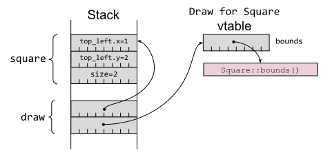

# 第 12 条：理解泛型和特征对象之间的权衡

[第2条]描述了如何使用特征来封装类型系统中的行为，作为相关方法的集合，并观察到有两种使用特征的方法：作为泛型的特征约束( `trait bound` )或特征对象( `trait object` )。本条探讨了这两种可能性之间的权衡。

下面是一个运行示例，请考虑一个涵盖显示图形对象的功能的特征：

```Rust
#[derive(Debug, Copy, Clone)]
pub struct Point {
    x: i64,
    y: i64,
}

#[derive(Debug, Copy, Clone)]
pub struct Bounds {
    top_left: Point,
    bottom_right: Point,
}

/// Calculate the overlap between two rectangles, or `None` if there is no
/// overlap.
fn overlap(a: Bounds, b: Bounds) -> Option<Bounds> {
    // ...
}

/// Trait for objects that can be drawn graphically.
pub trait Draw {
    /// Return the bounding rectangle that encompasses the object.
    fn bounds(&self) -> Bounds;

    // ...
}
```

## 泛型

Rust 的泛型大致等同于 C++ 的模板：它允许程序员编写适用于任意类型 `T` 的代码，而泛型代码的特定用途会在编译时生成--这一过程在 Rust 中称为*单态化(monomorphization)*，在 C++ 中称为*模板实例化(template instantiation)*。与 C++ 不同的是，Rust 在类型系统中以泛型的特质约束的形式明确编码了对 `T` 类型的期望。

例如，一个使用特征的 `bounds()` 方法的泛型函数具有显式的 `Draw` 特征约束：

```Rust
/// Indicate whether an object is on-screen.
pub fn on_screen<T>(draw: &T) -> bool
where
    T: Draw,
{
    overlap(SCREEN_BOUNDS, draw.bounds()).is_some()
}
```

这也可以通过将特征绑定放在泛型参数之后来更紧凑地编写：

```Rust
pub fn on_screen<T: Draw>(draw: &T) -> bool {
    overlap(SCREEN_BOUNDS, draw.bounds()).is_some()
}
```

或者使用 `impl Trait` 作为参数的类型[^1]：

```Rust
pub fn on_screen(draw: &impl Draw) -> bool {
    overlap(SCREEN_BOUNDS, draw.bounds()).is_some()
}
```

如果一个类型实现了特征：

```Rust
#[derive(Clone)] // no `Debug`
struct Square {
    top_left: Point,
    size: i64,
}

impl Draw for Square {
    fn bounds(&self) -> Bounds {
        Bounds {
            top_left: self.top_left,
            bottom_right: Point {
                x: self.top_left.x + self.size,
                y: self.top_left.y + self.size,
            },
        }
    }
}
```

然后该类型的实例可以传递给泛型函数，通过单例化来产生特定于一种特定类型的代码：

```Rust
let square = Square {
    top_left: Point { x: 1, y: 2 },
    size: 2,
};
// Calls `on_screen::<Square>(&Square) -> bool`
let visible = on_screen(&square);
```

如果将相同的泛型函数用于实现相关特征约束的其他类型：

```Rust
#[derive(Clone, Debug)]
struct Circle {
    center: Point,
    radius: i64,
}

impl Draw for Circle {
    fn bounds(&self) -> Bounds {
        // ...
    }
}
```

然后使用不同的单态化代码：

```Rust
let circle = Circle {
    center: Point { x: 3, y: 4 },
    radius: 1,
};
// Calls `on_screen::<Circle>(&Circle) -> bool`
let visible = on_screen(&circle);
```

换句话说，程序员编写了一个单一的泛型函数，但编译器会为每次调用该函数时使用的不同类型输出一个不同的单态化版本的函数。

## 特征对象

相比之下，特征对象是一个胖指针([第8条])，它将指向底层具体项目的指针与指向虚表（vtable）的指针结合在一起，而虚表又持有特征实现的所有方法的函数指针，如图 2-1 所示：

*图 2-1.特征对象布局，包含指向具体项目的指针和指向vtable的指针*

这意味着接受特征对象的函数不需要泛型，也不需要单态化：程序员使用特征对象编写函数，编译器只输出该函数的一个版本，它可以接受来自多种输入类型的特征对象：

```Rust
/// Indicate whether an object is on-screen.
pub fn on_screen(draw: &dyn Draw) -> bool {
    overlap(SCREEN_BOUNDS, draw.bounds()).is_some()
}
```
```Rust
// Calls `on_screen(&dyn Draw) -> bool`.
let visible = on_screen(&square);
// Also calls `on_screen(&dyn Draw) -> bool`.
let visible = on_screen(&circle);
```

## 基本比较

这些基本事实已经允许在两种可能性之间进行一些直接比较：
 - 泛型可能会导致代码量增大，因为编译器会为每个使用 `on_screen` 函数泛型版本的 `T` 类型生成一份全新的代码副本（ `on_screen::<T>(&T)` ）。相比之下，该函数的特征对象版本（ `on_screen(&dyn T)` ）只需要生成一个实例。
 - 从泛型中调用特征方法通常比从使用特征对象的代码中调用特征方法要稍微快一些，因为后者需要执行两次反引用来查找代码的位置（特征对象到 vtable，vtable 到实现位置）。
 - 泛型的编译时间可能会更长，因为编译器要编译更多代码，链接器要做更多工作来折叠重复代码。

在大多数情况下，这些差异并不显著--只有当你测量了优化的影响并发现它确实会产生影响（速度瓶颈或占用率增加）时，才应将优化相关的问题作为主要的决策驱动因素。

更重要的区别在于，通用特征约束可用于有条件地提供不同的功能，这取决于类型参数是否实现了*多个*特征：

```Rust
// The `area` function is available for all containers holding things
// that implement `Draw`.
fn area<T>(draw: &T) -> i64
where
    T: Draw,
{
    let bounds = draw.bounds();
    (bounds.bottom_right.x - bounds.top_left.x)
        * (bounds.bottom_right.y - bounds.top_left.y)
}

// The `show` method is available only if `Debug` is also implemented.
fn show<T>(draw: &T)
where
    T: Debug + Draw,
{
    println!("{:?} has bounds {:?}", draw, draw.bounds());
}
```
```Rust
let square = Square {
    top_left: Point { x: 1, y: 2 },
    size: 2,
};
let circle = Circle {
    center: Point { x: 3, y: 4 },
    radius: 1,
};

// Both `Square` and `Circle` implement `Draw`.
println!("area(square) = {}", area(&square));
println!("area(circle) = {}", area(&circle));

// `Circle` implements `Debug`.
show(&circle);

// `Square` does not implement `Debug`, so this wouldn't compile:
// show(&square);
```

特征对象只对单个特征的实现虚表进行编码，因此要做与之等价的事情就比较麻烦。例如，可以为 `show()` 情况定义一个组合 `DebugDraw` 特征，同时定义一个空白实现，以方便使用：

```Rust
trait DebugDraw: Debug + Draw {}

/// Blanket implementation applies whenever the individual traits
/// are implemented.
impl<T: Debug + Draw> DebugDraw for T {}
```

但是，如果存在不同特征的多种组合，这种方法的组合学显然会迅速变得臃肿不堪。

## 更多特征约束

除了使用特征约束来限制泛型函数可接受的类型参数外，还可以将其应用于特征定义本身：

```Rust
/// Anything that implements `Shape` must also implement `Draw`.
trait Shape: Draw {
    /// Render that portion of the shape that falls within `bounds`.
    fn render_in(&self, bounds: Bounds);

    /// Render the shape.
    fn render(&self) {
        // Default implementation renders that portion of the shape
        // that falls within the screen area.
        if let Some(visible) = overlap(SCREEN_BOUNDS, self.bounds()) {
            self.render_in(visible);
        }
    }
}
```

在本例中，`render()` 方法的默认实现（[第13条]）使用了特征 `bound`，依赖于 `Draw` 中的 `bounds()` 方法。

来自面向对象语言的程序员经常会混淆特征约束和继承，误以为这样的特征约束意味着 `Shape` *就是* `Draw`。事实并非如此：这两种类型之间的关系最好表述为 `Shape` *也实现了* `Draw`。

从底层来看，那些具有特征约束的特征对象：

```Rust
let square = Square {
    top_left: Point { x: 1, y: 2 },
    size: 2,
};
let draw: &dyn Draw = &square;
let shape: &dyn Shape = &square;
```

有一个组合的虚表，其中包括顶层特征的方法以及所有特征约束的方法。如图 2-2 所示：`Shape` 的虚表包括 `Draw` 特征的 `bounds` 方法，以及 `Shape` 特征本身的两个方法。

*图 2-2.具有 `Draw` 与 `Shape` 两种虚表的具有特征约束的特征对象*

在撰写本文时（截至Rust 1.70版本），没有办法从 `Shape` 向上转型到 `Draw`，因为无法在运行时恢复（纯净的） `Draw` 虚表；没有办法在相关的特征对象之间进行转换，这反过来又意味着没有[里氏替换原则（Liskov substitution）]。然而，这种情况很可能在 Rust 的后续版本中发生变化——有关更多信息，请参见[第19条]。

用不同的语言重复同样的观点，接受 `Shape` 特征对象的方法具有以下特征：
 - 它可以使用 `Draw` 的方法（因为 `Shape` 也实现了 `Draw`，而且 `Shape` 虚表中存在相关函数指针）。
 - 它还不能将特征对象传递给另一个期望使用 `Draw` 特征对象的方法（因为 `Shape` 不是 `Draw`，而且 `Draw` 虚表也不可用）。

相比之下，接受实现 `Shape` 的泛型方法具有以下特征：
 - 它可以使用 `Draw` 方法。
 - 它可以将项目传递给另一个具有 `Draw` 特征约束的泛型方法，因为特征约束在编译时被单态化为使用具体类型的 `Draw` 方法。

## 特征对象安全

对特征对象的另一个限制是对[对象安全]的要求：只有符合以下两条规则的特征才能用作特征对象：
 - 特征方法不能是通用的。
 - 特征的方法不能涉及包含 `Self` 的类型，但接收方（调用方法的对象）除外。

第一个限制很容易理解：泛型方法 `f` 是一组无限多的方法，可能包含 `f::<i16>`, `f::<i32>`, `f::<i64>`, `f::<u8>` 等。另一方面，特征对象的虚表在很大程度上是指针函数的有限集合，因此不可能将无限的单态实现集放入其中。

第二种限制比较微妙，但往往是在实践中更常遇到的限制--使用 `Copy` 或 `Clone` 特征约束（[第10条]）的特征会立即受到这条规则的限制，因为它们返回的是 `Self`。如果代码调用（例如） `let y = x.clone()`，会发生什么情况？调用代码需要在堆栈中为 `y` 预留足够的空间，但它不知道 `y` 的大小，因为 `Self` 是一个任意类型。因此，提及 `Self` 的返回类型会导致特征对对象不安全[^2]。

第二个限制有一个例外。如果 `Self` 对编译时已知大小的类型有明确的限制，即 `Sized` 标记特征作为特征，那么返回某种 `Self` 相关类型的方法就不会影响对象的安全性：

```Rust
/// A `Stamp` can be copied and drawn multiple times.
trait Stamp: Draw {
    fn make_copy(&self) -> Self
    where
        Self: Sized;
}
```
```Rust
let square = Square {
    top_left: Point { x: 1, y: 2 },
    size: 2,
};

// `Square` implements `Stamp`, so it can call `make_copy()`.
let copy = square.make_copy();

// Because the `Self`-returning method has a `Sized` trait bound,
// creating a `Stamp` trait object is possible.
let stamp: &dyn Stamp = &square;
```

这种特征约束意味着该方法无论如何都不能与特征对象一起使用，因为特征指的是未知大小的东西（`dyn Trait`），所以该方法违背了对象安全：

```Rust
// However, the method can't be invoked via a trait object.
let copy = stamp.make_copy();
```
```Rust
error: the `make_copy` method cannot be invoked on a trait object
   --> src/main.rs:397:22
    |
353 |         Self: Sized;
    |               ----- this has a `Sized` requirement
...
397 |     let copy = stamp.make_copy();
    |                      ^^^^^^^^^
```

## 权衡取舍

从目前各种因素的权衡来看，你应该更倾向于使用泛型而非特征对象，但在某些情况下，特征对象才是最合适的工具。

首先是实际考虑：如果生成代码的大小或编译时间是个问题，那么特征对象的性能会更好（如本项目前面所述）。

从理论上讲，特征对象从根本上涉及类型擦除：在转换为特征对象的过程中，具体类型的信息会丢失。这可能是一个缺点（见[第19条]），但它也可能是有用的，因为它允许异构对象的集合--因为代码只依赖于特质的方法，它可以调用和组合具有不同具体类型的项的方法。

渲染形状列表的传统面向对象例子就是一个例子：在同一个循环中，可以对正方形、圆形、椭圆形和星形使用相同的 `render()` 方法：

```Rust
let shapes: Vec<&dyn Shape> = vec![&square, &circle];
for shape in shapes {
    shape.render()
}
```

当编译时还不知道可用类型时，特征对象的潜在优势就显得模糊得多。如果新代码在运行时被动态加载（例如通过[dlopen(3)]），那么在新代码中实现特征的项目只能通过特征对象调用，因为没有源代码可以单态化。

原文[点这里](https://www.lurklurk.org/effective-rust/generics.html)查看

#### 注释

[^1]: 使用["impl Trait in argument position"](https://doc.rust-lang.org/reference/types/impl-trait.html#anonymous-type-parameters)并不完全等同于前两个版本，因为它取消了调用者通过类似`on_screen::<Circle>(&c)`这样的方式明确指定类型参数的功能。
[^2]: 在撰写本文时，对返回 `Self` 的方法的限制包括像 `Box<Self> ` 这样可以安全地存储在堆栈中的类型；这一限制将来可能会放宽。

<!-- 参考链接 -->
[第2条]: /chapter_1/item2-use-types-2.md
[第8条]: /chapter_1/item8-references&pointer.md
[第10条]: https://www.lurklurk.org/effective-rust/std-traits.html
[第13条]: item13-use-default-impl.md
[第19条]: https://www.lurklurk.org/effective-rust/reflection.html

[里氏替换原则（Liskov substitution）]: https://en.wikipedia.org/wiki/Liskov_substitution_principle
[对象安全]: https://doc.rust-lang.org/reference/items/traits.html#object-safety
[dlopen(3)]: https://man7.org/linux/man-pages/man3/dlopen.3.html
