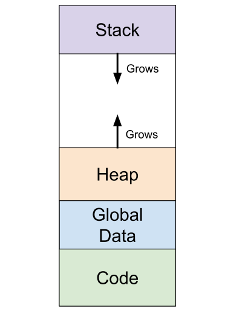
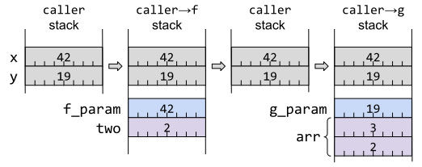

# 第 14 条：理解生命周期

这一条描述了 Rust 的生命周期，这是对先前的编译型语言（像 C 和 C++）中存在的概念的更精确的表述 —— 不仅仅在理论上，更是在实践中。生命周期是[第 15 条]中描述的*借用检查器*的必要标注；总的来说，这些功能构成了 Rust 内存安全保证的核心。

## 介绍一下栈

生命周期在根本上跟栈有关，所以快速过一遍栈的知识。

当一个程序运行时，内存会被分成不同的区块，有时被称为*段*。其中一些块是固定大小的，比如包含程序代码和全局变量的块，但是有两个块 —— *堆*和*栈* —— 会随着程序运行而改变大小。为了实现这一点，堆和栈通常排列在程序虚拟内存的两端，因此一个可以向下增长，另外一个可以向上增长（至少在你的程序耗尽了内存并崩溃之前），如图 3-1 所示。



*图 3-1. 程序内存布局，包括堆向上增长和栈向下增长*

对于这两个动态大小的块来说，栈用来保存与当前执行的函数相关的状态。该状态可能包含以下元素：

- 传递给函数的参数
- 函数中的局部变量
- 函数计算的临时值
- 函数调用者在代码中的返回地址

当调用函数 `f()`，一个新的栈帧（stack frame）会被添加到栈中，当超出栈帧结束的位置时，CPU 通常会更新*栈指针*寄存器，去指向新的栈帧。

当内部函数 `f()` 返回，栈指针会被重置到调用函数之前的位置，也就是调用者的完整且未修改的栈帧。

如果调用者随后调用了一个不同的函数 `g()`，这个过程会再次发生，这意味着 `g()` 的栈帧将复用 `f()` 先前使用的同一块内存区域（如图 3-2 所示）：

```rust
fn caller() -> u64 {
    let x = 42u64;
    let y = 19u64;
    f(x) + g(y)
}

fn f(f_param: u64) -> u64 {
    let two = 2u64;
    f_param + two
}

fn g(g_param: u64) -> u64 {
    let arr = [2u64, 3u64];
    g_param + arr[1]
}
```



*图 3-2. 随着函数调用和返回，栈使用的演变*

当然，这是实际情况的极大简化之后的版本 —— 将东西放入栈或取出栈需要时间，所以实际上处理器会有很多优化。然而，这个简化的概念图已经足以理解本条款的主题。

## 生命周期的演化

上一小节解释了参数和局部变量是如何在栈上存储的，同时指出了这些值只是临时存储的。

从历史上来说，这会允许出现一些危险情况：当你持有一个指向这些栈上临时值的指针，会发生什么？

对最开始的 C 来说，返回局部变量的指针是完全可以的（尽管现代编译器会警告）：

<div class="ferris"></div>

```c
/* C code. */
struct File {
  int fd;
};

struct File* open_bugged() {
  struct File f = { open("README.md", O_RDONLY) };
  return &f;  /* return address of stack object! */
}
```

如果你不幸地立刻使用了调用代码的返回值，你*或许*会避开这段代码导致的问题：

```c
struct File* f = open_bugged();
printf("in caller: file at %p has fd=%d\n", f, f->fd);
```

```shell
in caller: file at 0x7ff7bc019408 has fd=3
```

这是不幸的，因为它只是*看起来*能工作。一旦发生任何其他函数调用，栈区域将被复用，用于保存对象的区域也将会被覆盖：

```c
investigate_file(f);
```

```c
/* C code. */
void investigate_file(struct File* f) {
  long array[4] = {1, 2, 3, 4}; // put things on the stack
  printf("in function: file at %p has fd=%d\n", f, f->fd);
}
```

```shell
in function: file at 0x7ff7bc019408 has fd=1592262883
```

这个示例中，丢弃对象的内容会产生额外的不良副作用：打开的文件对应的文件描述符丢失了，因此结构体中保存的资源也就被程序给泄漏了。

发展到 C++ 后，失去资源访问权的问题通过引入*析构函数*得到了解决，从而启用了 RAII（参考[第 11 条]）。现在，栈上的东西有了自我清理的能力：如果对象持有某种资源，析构函数可以清理它，并且 C++ 编译器确保了在清理栈帧的过程中调用栈上对象的析构函数：

```cpp
// C++ code.
File::~File() {
  std::cout << "~File(): close fd " << fd << "\n";
  close(fd);
  fd = -1;
}
```

调用者现在获得了一个指向已被销毁并且它的资源已经被回收的对象的（无效）指针：

```cpp
File* f = open_bugged();
printf("in caller: file at %p has fd=%d\n", f, f->fd);
```

```shell
~File(): close fd 3
in caller: file at 0x7ff7b6a7c438 has fd=-1
```

然而，C++ 没有采取任何措施来解决悬垂指针的问题：持有一个指向已经销毁对象（通过调用析构函数）的指针仍是可能的：

```cpp
// C++ code.
void investigate_file(File* f) {
  long array[4] = {1, 2, 3, 4}; // put things on the stack
  std::cout << "in function: file at " << f << " has fd=" << f->fd << "\n";
}
```

```shell
in function: file at 0x7ff7b6a7c438 has fd=-183042004
```

作为一个 C/C++ 程序员，需要你来注意这一点，并确保你不会解引用一个指向已消失内容的指针。或者，如果你是一名攻击者并且发现一个悬垂指针，那么你很可能疯狂地咯咯笑，并且兴高采烈地解引用该指针来利用该漏洞。

对于 Rust 来说。Rust 的核心吸引力就是从根本上解决了悬垂指针的问题，这立即解决了一堆安全问题。[^1]

为了这一点需要把生命周期的概念从后台（C/C++ 程序员只知道需要注意它们，但没有任何语言层面的支持）拿到前台来：每个包含 `&` 符号的类型都有一个关联的生命周期（`'a`），即使编译器允许你在大部分时间忽略它。

## 生命周期的作用域

一个在栈上的数据的生命周期是保证它在栈上同一个位置的时间段；换句话说，生命周期是保证对该数据的*引用*（指针）不会变得无效的时间段。

一个数据的生命周期从被创建开始，一直到该数据*被 drop*（Rust 中与 C++ 中对象销毁相同的概念）或*被移动*。

Rust 中生命周期的普遍性有时会让来自 C/C++ 的程序员惊讶：很多情况下，Rust 将数据从栈上的一个位置移动到另一个位置，或者从栈移动到堆上，或者从堆移动到栈上。

该数据被自动 drop 的确切位置取决于该数据是否有一个名称。

局部变量和函数参数都提供了名称，并且对应的生命周期从该数据有名称开始：

- 对于局部变量：在 `let var = ...` 处声明
- 对于函数参数：作为函数调用执行框架设置的一部分

当有名称的数据被移动或者名称超出范围，该命名数据的生命周期就会结束：

```rust
#[derive(Debug, Clone)]
/// 某数据的定义
pub struct Item {
    contents: u32,
}
```

```rust
{
    let item1 = Item { contents: 1 }; // `item1` 数据 1 在此创建
    let item2 = Item { contents: 2 }; // `item2` 数据 2 在此创建
    println!("item1 = {item1:?}, item2 = {item2:?}");
    consuming_fn(item2); // `item2` 数据 2 在此被移动
} // `item1` 数据 1 在此被 drop
```

还可以“即时”地创建一个数据，作为要传入到其他数据的一部分。这些未命名的数据在不再需要时被 drop。考虑这个问题一个简单但有效的方法是想象表达式的每个部分都会展开它自己的块，通过编译器插入临时变量。例如，这样的表达式：

```rust
let x = f((a + b) * 2);
```

大致相当于：

```rust
let x = {
    let temp1 = a + b;
    {
        let temp2 = temp1 * 2;
        f(temp2)
    } // `temp2` 临时数据 2 在这里 drop
}; // `temp1` 临时数据 1 在这里 drop
```

当执行到原始行末尾的分号时，临时数据已经全部被 drop。

查看编译器计算数据生命周期的一种方法是插入一个故意的错误，来让借用检查器（[第 15 条]）检测。例如，保留对超出生命周期的数据的引用：

<div class="ferris"></div>

```rust
let r: &Item;
{
    let item = Item { contents: 42 };
    r = &item;
}
println!("r.contents = {}", r.contents);
```

错误消息会指明 `item` 的生命周期的确切终点：

```shell
error[E0597]: `item` does not live long enough
   --> src/main.rs:190:13
    |
189 |         let item = Item { contents: 42 };
    |             ---- binding `item` declared here
190 |         r = &item;
    |             ^^^^^ borrowed value does not live long enough
191 |     }
    |     - `item` dropped here while still borrowed
192 |     println!("r.contents = {}", r.contents);
    |                                 ---------- borrow later used here
```

同样的，对于未命名的临时数据：

```rust
let r: &Item = fn_returning_ref(&mut Item { contents: 42 });
println!("r.contents = {}", r.contents);
```

错误消息显示了表达式末尾的终点：

```shell
error[E0716]: temporary value dropped while borrowed
   --> src/main.rs:209:46
    |
209 | let r: &Item = fn_returning_ref(&mut Item { contents: 42 });
    |                                      ^^^^^^^^^^^^^^^^^^^^^ - temporary
    |                                      |           value is freed at the
    |                                      |           end of this statement
    |                                      |
    |                                      creates a temporary value which is
    |                                      freed while still in use
210 | println!("r.contents = {}", r.contents);
    |                             ---------- borrow later used here
    |
    = note: consider using a `let` binding to create a longer lived value
```

关于*引用*的生命周期的最后一点：如果编译器可以证明代码中某处之后没有再使用该引用，那么它将最后使用的位置视为引用的生命周期的末尾端点，而不是在一个作用域的末尾。这个特性被称为[非词法生命周期]（NLL），这允许借用检查器更灵活一些：

```rust
{
    // `s` 拥有 `String`。
    let mut s: String = "Hello, world".to_string();

    // 创建一个 `String` 的可变引用。
    let greeting = &mut s[..5];
    greeting.make_ascii_uppercase();
    // .. 在这之后没再使用 `greeting`

    // 创建一个 `String` 的不可变引用是允许的，
    // 即使这里有一个可变引用还在该作用域内。
    let r: &str = &s;
    println!("s = '{}'", r); // s = 'HELLO, world'
} // 可变引用 `greeting` 会在这里被 drop。
```

## 生命周期标注

尽管 Rust 中处理引用时生命周期无处不在，但是你不必详细标注 —— 没有人会说：“我正在处理 `ref.rs` 从第 17 行延伸到第 32 行的生命周期”。相反，代码中可以通过任意名称来引用生命周期，通常是 `'a`，`'b`，`'c` 等等，并且编译器有其自己内部的、不可访问的表示形式来对应源代码中内容。（唯一例外是 `'static` 生命周期，这是一个特殊情况，后续将会介绍。）

你不必对生命周期的名称考虑太多；主要考虑的事情是比较一个名称和另一个名称，或重复名称来标注两个生命周期是“相同的”。

这种生命周期标注最容易用函数签名来说明：如果函数的输入和输出需要处理引用，那么它们的生命周期之间是什么关系？

最常见的情况就是接收单个引用作为输入并返回一个引用的函数。返回的引用必须有一个生命周期，那么是什么呢？这里只有一种可能（除了 `'static`）可供选择：输入的生命周期，这意味着它们共享相同的名称，例如 `'a`。把该名称作为生命周期标注，添加给这两个类型会得到：

```rust
pub fn first<'a>(data: &'a [Item]) -> Option<&'a Item> {
    // ...
}
```

因为这种情况非常常见，并且因为输出的生命周期应该是什么（几乎）没有选择，Rust 具有*生命周期省略*规则，这意味着你不必为这种情况显式标注生命周期名称。相同的函数签名更惯用的版本应该是这样的：

```rust
pub fn first(data: &[Item]) -> Option<&Item> {
    // ...
}
```

所涉及的引用仍具有生命周期 —— 省略规则只是意味着你不必编写任何生命周期名称并在这两个地方使用它。

如果有不止一种输入的生命周期选择可以映射到返回值的生命周期呢？这种情况下，编译器无法弄清楚该怎么做：

```rust
pub fn find(haystack: &[u8], needle: &[u8]) -> Option<&[u8]> {
    // ...
}
```

```shell
error[E0106]: missing lifetime specifier
   --> src/main.rs:56:55
   |
56 | pub fn find(haystack: &[u8], needle: &[u8]) -> Option<&[u8]> {
   |                       -----          -----            ^ expected named
   |                                                     lifetime parameter
   |
   = help: this function's return type contains a borrowed value, but the
           signature does not say whether it is borrowed from `haystack` or
           `needle`
help: consider introducing a named lifetime parameter
   |
56 | pub fn find<'a>(haystack: &'a [u8], needle: &'a [u8]) -> Option<&'a [u8]> {
   |            ++++            ++                ++                  ++
```

基于函数和参数的名称，你可能会假设此处输出的预期生命周期应该和输入的 `haystack` 匹配：

```rust
pub fn find<'a, 'b>(
    haystack: &'a [u8],
    needle: &'b [u8],
) -> Option<&'a [u8]> {
    // ...
}
```

有趣的是，编译器建议了一种不同的方式：让函数的两个输入使用*相同的*生命周期 `'a`。例如，这种生命周期的组合方式在下面这个函数里或许是有意义的：

```rust
pub fn smaller<'a>(left: &'a Item, right: &'a Item) -> &'a Item {
    // ...
}
```

这*似乎*暗示输入的两个生命周期是“一样的”，但这里和之前添加的引号表明情况可能不完全是这样。

设计生命周期的目的就是确保数据的引用不会活得比数据本身更长；考虑到这点，输出的生命周期 `'a` 与输入的生命周期 `'a` “相同”，只是意味着输入必须比输出活得久。

当两个生命周期都是“相同的” `'a` 时，这仅意味着输出的生命周期必须包含在两个输入的生命周期内。

```rust
{
    let outer = Item { contents: 7 };
    {
        let inner = Item { contents: 8 };
        {
            let min = smaller(&inner, &outer);
            println!("smaller of {inner:?} and {outer:?} is {min:?}");
        } // `min` dropped
    } // `inner` dropped
} // `outer` dropped
```

换句话说，输出的生命周期必须包含在两个输入的生命周期中*较小的*那一个里。

相反，如果生命周期与输入之一的生命周期无关，则不需要这些生命周期嵌套：

```rust
{
    let haystack = b"123456789"; // 生命周期 'a 开始
    let found = {
        let needle = b"234"; // 生命周期 'b 开始
        find(haystack, needle)
    }; // 生命周期 'b 结束
    println!("found={:?}", found); // `found` 在 'a 内部，在 'b 外部使用
} // 生命周期 'a 结束
```

## 生命周期省略规则

除了前面描述的“一入，一出”的省略规则之外，还有另外两种可以省略标注生命周期名称的规则。

第一种情况是函数的输出没有引用；这种情况下，输入的引用都会自动获得自己的生命周期，且与其他输入的参数不同。

第二种情况是方法中有 `self` 的引用（`&self` 或 `&mut self`）；这种情况下，编译器会假设任何输出的引用的生命周期与 `self` 相同，因为这（到目前为止）是最常见的情况。

以下是函数生命周期省略规则的总结：

- 一个输入，一个或者多个输出：假设输入和输出有“相同的”生命周期：

```rust
fn f(x: &Item) -> (&Item, &Item)
// ... 相当于 ...
fn f<'a>(x: &'a Item) -> (&'a Item, &'a Item)
```

- 多个输入，没有输出：假设所有输入都有不同的生命周期：

```rust
fn f(x: &Item, y: &Item, z: &Item) -> i32
// ... 相当于 ...
fn f<'a, 'b, 'c>(x: &'a Item, y: &'b Item, z: &'c Item) -> i32
```

- 多个输入，包括 `&self`，一个或多个输出：假设输出的生命周期与 `&self` 的生命周期“相同”：

```rust
fn f(&self, y: &Item, z: &Item) -> &Thing
// ... 相当于 ...
fn f(&'a self, y: &'b Item, z: &'c Item) -> &'a Thing
```

当然，如果省略的生命周期标注没有达到你的预期，你仍可以显式标注生命周期来指定哪些生命周期彼此相关。实际上，这时很可能会导致编译报错，该错误表明省略的生命周期不能匹配函数或调用者涉及的引用。

## `'static` 生命周期

上一节描述了函数的输入和输出的引用的生命周期之间的各种可能的映射，但是忽略了一种特殊情况。如果没有输入生命周期，但输出的返回值仍然包含引用会发生什么？

```rust
pub fn the_answer() -> &Item {
    // ...
}
```

```shell
error[E0106]: missing lifetime specifier
   --> src/main.rs:471:28
    |
471 |     pub fn the_answer() -> &Item {
    |                            ^ expected named lifetime parameter
    |
    = help: this function's return type contains a borrowed value, but there
            is no value for it to be borrowed from
help: consider using the `'static` lifetime
    |
471 |     pub fn the_answer() -> &'static Item {
    |                             +++++++
```

唯一允许的改正是对于返回的引用，有一个生命周期保证它永远不会超出作用范围。这是由特殊的生命周期 `'static` 来标注的，它也是唯一一个有指定名称而不是任意占位符名称的生命周期。

```rust
pub fn the_answer() -> &'static Item {
```

获取有 `'static` 生命周期的引用最简单的方法是引用已经标记为 [static] 的全局变量：

```rust
static ANSWER: Item = Item { contents: 42 };

pub fn the_answer() -> &'static Item {
    &ANSWER
}
```

Rust 编译器保证这个 `static` 变量在整个程序的持续时间中具有相同的地址并永远不会移动。这意味着 `static` 变量具有 `'static` 生命周期，从逻辑上来说是这样。

很多情况下，对 `const` 变量的引用也会被[提升]为 `'static` 生命周期，但是有一些小的副作用需要注意。首先，如果涉及的类型具有析构函数或者内部可变性，则不会发生此提升：

<div class="ferris"></div>

```rust
pub struct Wrapper(pub i32);

impl Drop for Wrapper {
    fn drop(&mut self) {}
}

const ANSWER: Wrapper = Wrapper(42);

pub fn the_answer() -> &'static Wrapper {
    // `Wrapper` 有析构函数，所以 const 变量的引用无法提升到 `'static` 生命周期
    &ANSWER
}
```

```shell
error[E0515]: cannot return reference to temporary value
   --> src/main.rs:520:9
    |
520 |         &ANSWER
    |         ^------
    |         ||
    |         |temporary value created here
    |         returns a reference to data owned by the current function
```

第二个潜在副作用是，只有 `const` 的*值*才能保证在各处都相同；无论变量在何处被使用，编译器都可以根据需要制作任意份拷贝。如果你正在依赖 `'static` 引用背后的底层指针值来做些邪恶的事情，请注意这可能涉及多个内存位置。

还有一种方法来获取具有 `'static` 生命周期的引用。`'static` 主要承诺了该生命周期应该比程序中任何其他生命周期都长；在堆上分配且*从未释放*的值也满足此约束。

普通的堆上分配 `Box<T>` 在此处不起作用，因为不能保证（如下一节所述）该数据不会在超出作用域后被丢弃。

<div class="ferris"></div>

```rust
{
    let boxed = Box::new(Item { contents: 12 });
    let r: &'static Item = &boxed;
    println!("'static item is {:?}", r);
}
```

```shell
error[E0597]: `boxed` does not live long enough
   --> src/main.rs:344:32
    |
343 |     let boxed = Box::new(Item { contents: 12 });
    |         ----- binding `boxed` declared here
344 |     let r: &'static Item = &boxed;
    |            -------------   ^^^^^^ borrowed value does not live long enough
    |            |
    |            type annotation requires that `boxed` is borrowed for `'static`
345 |     println!("'static item is {:?}", r);
346 | }
    | - `boxed` dropped here while still borrowed
```

然而，[`Box::leak`] 函数可以把已有所有权的 `Box<T>` 变为 `T` 的可变引用。不再有所有者拥有该值的所有权，因此它将会永远不会被删除 —— 这满足了 `'static` 生命周期的要求：

```rust
{
    let boxed = Box::new(Item { contents: 12 });

    // `leak()` 销毁了 `Box<T>` 并返回 `&mut T`.
    let r: &'static Item = Box::leak(boxed);

    println!("'static item is {:?}", r);
} // `boxed` 在这里没被 drop，因为它被移动进了 `Box::leak()`

// 因为 `r` 没有超出作用域，`Item` 被永远的泄漏了。
```

无法 drop 该数据也意味着永远无法使用安全的 Rust 来回收该数据的内存，这可能会导致永久性的内存泄漏。（注意，这块泄漏的内存并不违反 Rust 的内存安全保证 —— 内存中永远无法访问的数据仍然是安全的。）

## 生命周期和堆

到目前为止的讨论集中在栈上数据的生命周期，无论是函数参数，局部变量或临时变量。但堆上的数据又如何呢？

关于堆上的值要认识到关键的事情是每块数据都有一个所有者（除了特殊情况，例如上一节描述的故意泄漏）。例如，一个简单的 `Box<T>` 就可以把 `T` 的值放堆上，同时持有 `Box<T>` 的变量也就拥有了所有权。

```rust
{
    let b: Box<Item> = Box::new(Item { contents: 42 });
} // `b` 在此 drop，那么 `Item` 也 drop 了。
```

拥有所有权的 `Box<Item>` 在超出生命周期范围后 drop 了里面的数据，因此堆上的 `Item` 的生命周期与栈上的的 `Box<Item>` 相同。

堆上的值的所有者本身可能也在堆上，而不是栈上，那么此时谁拥有该所有者？

```rust
{
    let b: Box<Item> = Box::new(Item { contents: 42 });
    let bb: Box<Box<Item>> = Box::new(b); // `b` 被移动到堆上
} // `bb` 在此 drop，那么 `Box<Item>` 也 drop 了，那么 `Item` 也 drop 了。
```

所有权链必须在某处结束，并只有两种可能性：

- 该链以局部变量或函数参数结束 —— 这种情况下该链中所有数据的生命周期就是栈上变量的生命周期 `'a`。当栈上的变量超出作用域，该链上所有数据也都被 drop。
- 该链以标记了 `static` 的全局变量结束 —— 这种情况下，链中所有的数据的生命周期都是 `'static` 的，`static` 变量永远不会超出作用域，所以链中任何内容都不会被自动 drop。

所以，堆上数据的生命周期根本上是绑定到栈上的生命周期。

## 结构体中的生命周期

前面关于生命周期的章节集中于函数的输入和输出，但是存储在结构体中的引用也存在类似问题。

如果试图在不使用生命周期标注的情况下，偷偷把引用放到结构体中，编译器会发生尖锐的爆鸣声：

```rust
pub struct ReferenceHolder {
    pub index: usize,
    pub item: &Item,
}
```

```shell
error[E0106]: missing lifetime specifier
   --> src/main.rs:548:19
    |
548 |         pub item: &Item,
    |                   ^ expected named lifetime parameter
    |
help: consider introducing a named lifetime parameter
    |
546 ~     pub struct ReferenceHolder<'a> {
547 |         pub index: usize,
548 ~         pub item: &'a Item,
    |
```

像往常一样，编译器错误信息告诉我们应该怎么做。第一部分很简单：为引用类型显式标注一个生命周期 `'a`，因为在结构体中使用引用是没有相应的生命周期省略规则的。

第二部分不太明显，但具有更深层次的影响：结构体本身需要一个生命周期参数 `<'a>`，它与包含的引用的生命周期相匹配：

```rust
// 由于字段有引用，所以结构体需要有生命周期参数
pub struct ReferenceHolder<'a> {
    pub index: usize,
    pub item: &'a Item,
}
```

结构体的生命周期参数具有传染性：任何结构体包含了该类型也必须获取一个生命周期参数：

```rust
// 由于字段有生命周期参数，所以结构体需要有生命周期参数
pub struct RefHolderHolder<'a> {
    pub inner: ReferenceHolder<'a>,
}
```

如果结构体包含切片类型，则也需要生命周期参数，因为它们又是对借用数据的引用。

如果结构体包含多个相互关联的生命周期的字段，那么你必须选择合适的生命周期绑定。在一对字符串内查找公共子串是一个非常好的具有独立生命周期的例子：

```rust
/// 一对字符串的公共子串存在的位置。
pub struct LargestCommonSubstring<'a, 'b> {
    pub left: &'a str,
    pub right: &'b str,
}

/// 在 `left` 和 `right` 字符串中找到最长公共子串。
pub fn find_common<'a, 'b>(
    left: &'a str,
    right: &'b str,
) -> Option<LargestCommonSubstring<'a, 'b>> {
    // ...
}
```

而引用同一字符串的多个位置的结构体，将具有共同的生命周期：

```rust
/// 在一个字符串内重复的两个子串
pub struct RepeatedSubstring<'a> {
    pub first: &'a str,
    pub second: &'a str,
}

/// 找到 `s` 中第一个重复子串。
pub fn find_repeat<'a>(s: &'a str) -> Option<RepeatedSubstring<'a>> {
    // ...
}
```

生命周期参数的传播是有意义的：任何包含引用的东西，无论嵌套多深，都仅在所引用数据的生命周期内有效。如果该数据被移动或 drop，那么整个结构体嵌套链都不再有效。

然而，这也意味着涉及引用的结构体更难使用 —— 结构体的所有者必须保证生命周期全部一致。因此，**尽可能选择拥有其内部数据所有权的结构体**，特别是在代码不需要高度优化([第 20 条])的情况下。如果做不到这一点，[第 8 条]描述的各种智能指针类型（例如 [`Rc`]）可以让你从生命周期约束中解放出来。

## 匿名生命周期

当不能保证一个结构体拥有其数据的所有权时，结构体必然需要指定生命周期参数，如上一节所述。当其与本条款之前描述的生命周期省略规则结合在一起时，值得注意一下。

例如，考虑一个返回带有生命周期参数的结构体的函数。如果对该函数进行完全显式标注，则涉及到的生命周期是清晰易读的：

```rust
pub fn find_one_item<'a>(items: &'a [Item]) -> ReferenceHolder<'a> {
    // ...
}
```

然而，省略生命周期的相同标注可能会有点误导：

```rust
pub fn find_one_item(items: &[Item]) -> ReferenceHolder {
    // ...
}
```

因为返回类型的生命周期参数被省略，因此阅读代码的人不会得到太多涉及生命周期的提示。

匿名生命周期 `'_` 允许你将省略的生命周期标注出来，而无需指定*所有的*生命周期名称。

```rust
pub fn find_one_item(items: &[Item]) -> ReferenceHolder<'_> {
    // ...
}
```

粗略地说，`'_` 标注要求编译器为我们生成一个唯一的生命周期名称，如果不需要在其他地方使用该名称，我们可以使用这种方式。

这意味着对于其他生命周期省略场景也很有用。例如，`Debug` trait 的 `fmt` 方法，使用匿名生命周期来指示 `Formatter` 实例具有和 `&self` 不同的生命周期，但该生命周期是什么名称并不重要：

```rust
pub trait Debug {
    fn fmt(&self, f: &mut Formatter<'_>) -> Result<(), Error>;
}
```

## 需要记住的事情

- 所有的 Rust 引用都有一个关联的生命周期，由生命周期标签(比如 `'a`)指示。在某些常见情况下，函数参数和返回值的生命周期可以省略（但仍然存在）。
- 任何（直接或间接地）包含引用的结构体都有关联的生命周期参数；因此，使用拥有其数据所有权的结构体通常更容易。
- `'static` 生命周期用来指向保证永远不会超出作用域的数据的引用，例如全局数据或堆上已经显式泄漏的数据。
- 生命周期标签只能指示生命周期是“相同的”，这意味着输出的生命周期被包含在输入的一个（或更多）生命周期内。
- 匿名生命周期 `'_` 可以用在不需要特定生命周期标签的地方。

## 注释

[^1]: 例如，Chromium 项目估计 [70% 的安全相关的代码缺陷都归咎于内存安全。](https://www.chromium.org/Home/chromium-security/memory-safety/)

原文[点这里](https://www.lurklurk.org/effective-rust/lifetimes.html)查看

<!-- 参考链接 -->

[第 8 条]: ../chapter_1/item8-references&pointer.md
[第 11 条]: ../chapter_2/item11-impl-drop-for-RAII.md
[第 15 条]: ../chapter_3/item15-borrows.md
[第 20 条]: ../chapter_3/item20-optimize.md

[非词法生命周期]: https://rust-lang.github.io/rfcs/2094-nll.html
[static]: https://doc.rust-lang.org/std/keyword.static.html
[提升]: https://doc.rust-lang.org/reference/destructors.html#constant-promotion
[`Box::leak`]: https://doc.rust-lang.org/std/boxed/struct.Box.html#method.leak
[`Rc`]: https://doc.rust-lang.org/std/rc/struct.Rc.html
