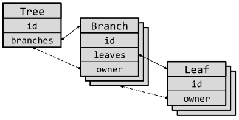

# 第 15 条：理解借用检查器

Rust 中的每一个值都有一个所有者，但该所有者可以将值借用到代码中的其他位置。这种*借用*机制涉及*引用*的创建和使用。并遵守*借用检查器*（本条款的主题）的规则。

抛开表面，Rust 引用使用了与 C 或 C++ 代码中相同类型的也是相当常见的*指针*值（[第 8 条]），但为了确保避免 C/C++ 中的不足，这个指针是有规则和限制的。先来快速比较一下：

- 像 C/C++ 指针一样，Rust 引用使用 `&` 符号创建：`&value`。
- 像 C++ 引用一样，Rust 引用不能为 `nullptr`。
- 像 C/C++ 指针或引用一样，Rust 引用可以在创建后进行修改来指向不同的内容。
- 与 C++ 不同，从值创建的引用总是需要显式传参（`&`）—— 如果你看到这样的代码 `f(value)`，你应该意识到 `f` 正在接收传入值的所有权。（但是，如果这个 `value` 的类型实现了 [`Copy`]，那么它可能接收的是该数据的拷贝的所有权 —— 详见[第 10 条]。）
- 与 C/C++ 不同，新创建的可变引用总是需要显式标明（`&mut`）。如果你看到了这样的代码 `f(&value)`，你应该意识到 `value` 不能被改变（即 C/C++ 中的 `const`）。只有像 `f(&mut value)` 这样的表达式才可能更改 `value` 的内容。[^1]

C/C++ 指针和 Rust 引用之间最重要的区别由术语*借用*表示：你可以获取某个数据的引用（指针），*但是你不能永久持有该引用*。特别是，你对它的持有不能比它所指向的数据的生命周期更长，正如我们在[第 14 条]中探索过的由编译器所跟踪的生命周期一样。

这些对引用的限制使得 Rust 能保证其内存安全，但这也意味着你需要接受借用规则的学习成本，并接受它改变你如何设计软件的方式 —— 尤其是存储数据的结构体。

本条款将首先描述 Rust 的引用可以做什么，以及使用它们的借用检查器规则。本条款的其余部分将重点关注如何应对这些规则的影响：如何重构、返工和重新设计代码，以便在与借用检查器斗争中获胜。

## 访问控制

有三种办法来访问一块 Rust 数据：通过这块数据的*所有者（`item`）*、*引用（`&item`）*或*可变引用（`&mut item`）*。每种访问数据的方式都有不同的访问权。使用 [CRUD]（增删改查）存储模型来粗略地概括（Rust 的 *drop* 术语即 *delete*）：

- 数据的所有者可以 *创建（create）*、*读取（read）*、*更新（update）* 或 *删除（drop）* 它。
- 可变引用可以从底层数据中*读取*，或*更新*它。
- （普通）引用只能*读取*底层数据。

这儿有个 Rust 独有的数据访问规则：只有该数据的所有者可以*移动*该数据。如果你认为移动就是某种（在新位置）*创建*并（在旧位置）*drop* 这些数据占用的内存的组合，这或许有点道理。

对于使用了数据可变引用的代码，这可能会导致一些奇怪情况。例如，下面的代码中替换 `Option` 内部值的操作是允许的：

```rust
/// 这段代码使用的结构体。
#[derive(Debug)]
pub struct Item {
    pub contents: i64,
}

/// 替换 `item` 的内容为 `val`。
pub fn replace(item: &mut Option<Item>, val: Item) {
    *item = Some(val);
}
```

但是返回替换之前的值的操作违反了移动限制：[^2]

<div class="ferris"></div>

```rust
/// 替换 `item` 的内容为 `val`，并返回替换之前的内容。
pub fn replace(item: &mut Option<Item>, val: Item) -> Option<Item> {
    let previous = *item; // 移出所有权
    *item = Some(val); // 替换
    previous
}
```

```shell
error[E0507]: cannot move out of `*item` which is behind a mutable reference
  --> src/main.rs:34:24
   |
34 |         let previous = *item; // move out
   |                        ^^^^^ move occurs because `*item` has type
   |                              `Option<inner::Item>`, which does not
   |                              implement the `Copy` trait
   |
help: consider removing the dereference here
   |
34 -         let previous = *item; // move out
34 +         let previous = item; // move out
   |
```

尽管从一个可变引用*读取*是有效的，但这段代码尝试在用新值替换该被移动的值之前，将值*移出* —— 并试图避免复制（copy）原始值。借用检查器非常保守，并注意到在两行中间存在一段可变引用未引用有效值的时间段。

对人来说，我们知道这种组合操作 —— 提取旧值并使用新值替换 —— 是既安全又实用的，所以标准库提供了 [`std::mem::replace`] 函数。`replace` 在底层使用了 `unsafe`（参考[第 16 条]）来一次性执行交换：

```rust
/// 替换 `item` 的内容为 `val`，并返回替换之前的 content。
pub fn replace(item: &mut Option<Item>, val: Item) -> Option<Item> {
    std::mem::replace(item, Some(val)) // 返回之前的值
}
```

特别对于 `Option` 类型，由于这是一种非常常见的模式，所以 `Option` 自己提供了 [`replace`] 方法：

```rust
/// 替换 `item` 的内容为 `val`，并返回替换之前的 content。
pub fn replace(item: &mut Option<Item>, val: Item) -> Option<Item> {
    item.replace(val) // 返回之前的值
}
```

## 借用规则

Rust 中借用引用时主要有两条关键规则需牢记。

第一条规则是任何引用的作用域必须小于所引用的数据的生命周期。[第 14 条]详细讨论了生命周期，但是值得注意的是编译器对于引用生命周期有特殊行为；*非词法生命周期*特性允许引用生命周期缩短，以便让他们在最后一次使用时结束，而不是在作用域末尾结束。

借用引用的第二条规则是，除了数据的所有者之外，还可以是以下任意一种借用方式：

- 对数据的任意数量不可变引用
- 对数据的单个可变引用

当然，不能同时是两者（在代码中的同一个位置）。

因此，同一个数据的引用可以被传入参数为多个不可变引用的函数：

```rust
/// 判断两个参数是否都为零。
fn both_zero(left: &Item, right: &Item) -> bool {
    left.contents == 0 && right.contents == 0
}

let item = Item { contents: 0 };
assert!(both_zero(&item, &item));
```

但是参数有多个*可变*引用就不能了：

<div class="ferris"></div>

```rust
/// 将两个参数的内容都清零。
fn zero_both(left: &mut Item, right: &mut Item) {
    left.contents = 0;
    right.contents = 0;
}

let mut item = Item { contents: 42 };
zero_both(&mut item, &mut item);
```

```shell
error[E0499]: cannot borrow `item` as mutable more than once at a time
   --> src/main.rs:131:26
    |
131 |     zero_both(&mut item, &mut item);
    |     --------- ---------  ^^^^^^^^^ second mutable borrow occurs here
    |     |         |
    |     |         first mutable borrow occurs here
    |     first borrow later used by call
```

对于函数参数同时有可变引用和不可变引用的混合体来说，也有同样的限制：

<div class="ferris"></div>

```rust
/// 把 `left` 的 content 设置为 `right` 的 content。
fn copy_contents(left: &mut Item, right: &Item) {
    left.contents = right.contents;
}

let mut item = Item { contents: 42 };
copy_contents(&mut item, &item);
```

```shell
error[E0502]: cannot borrow `item` as immutable because it is also borrowed
              as mutable
   --> src/main.rs:159:30
    |
159 |     copy_contents(&mut item, &item);
    |     ------------- ---------  ^^^^^ immutable borrow occurs here
    |     |             |
    |     |             mutable borrow occurs here
    |     mutable borrow later used by call
```

借用规则允许编译器对数据的[别名]作出更好的决策：即跟踪何时两个不同的指针可能指向内存中同一个底层数据。如果编译器可以确定（正如 Rust 中那样）一些不可变引用所指向的内存位置，不会通过一个已设置别名的*可变*引用进行更改，那么编译器可以生成具有以下优点的代码：

- *更好的优化*：例如值可以被缓存到寄存器中，因为已知底层的内存存储的内容不会在这个时候发生改变。
- *更安全*：线程之间对内存的不同步访问（[第 17 条]）不会引起数据竞争。

## 所有者操作

围绕引用存在的规则导致了一个重要后果，它们还会影响数据所有者可执行的操作。帮助理解这一点的一种方法是想象涉及所有者的操作是通过在幕后创建和使用引用来执行的。

例如，尝试通过数据所有者来更新数据相当于创建了一个临时的可变引用，然后通过这个引用来更新数据。如果另外一个引用已存在，那么这个名义上的第二个可变引用将会无法被创建：

<div class="ferris"></div>

```rust
let mut item = Item { contents: 42 };
let r = &item;
item.contents = 0;
// ^^^ 更改这个 item 大概相当于：
//   (&mut item).contents = 0;
println!("reference to item is {:?}", r);
```

```shell
error[E0506]: cannot assign to `item.contents` because it is borrowed
   --> src/main.rs:200:5
    |
199 |     let r = &item;
    |             ----- `item.contents` is borrowed here
200 |     item.contents = 0;
    |     ^^^^^^^^^^^^^^^^^ `item.contents` is assigned to here but it was
    |                       already borrowed
...
203 |     println!("reference to item is {:?}", r);
    |                                           - borrow later used here
```

另一方面，由于多个*不可变*引用是被允许的，因此当存在不可变引用时，从所有者读取数据是可以的：

```rust
let item = Item { contents: 42 };
let r = &item;
let contents = item.contents;
// ^^^ 从 item 中读取大概相当于：
//   let contents = (&item).contents;
println!("reference to item is {:?}", r);
```

但是存在*可变引用*是不可以的：

```rust
let mut item = Item { contents: 42 };
let r = &mut item;
let contents = item.contents; // i64 实现了 `Copy`
r.contents = 0;
```

```shell
error[E0503]: cannot use `item.contents` because it was mutably borrowed
   --> src/main.rs:231:20
    |
230 |     let r = &mut item;
    |             --------- `item` is borrowed here
231 |     let contents = item.contents; // i64 implements `Copy`
    |                    ^^^^^^^^^^^^^ use of borrowed `item`
232 |     r.contents = 0;
    |     -------------- borrow later used here
```

最后，任何处于活动状态的引用都会阻止数据的所有者移动或 drop 数据，因为这样的话，意味着引用将会指向无效的数据：

```rust
let item = Item { contents: 42 };
let r = &item;
let new_item = item; // 移动
println!("reference to item is {:?}", r);
```

```shell
error[E0505]: cannot move out of `item` because it is borrowed
   --> src/main.rs:170:20
    |
168 |     let item = Item { contents: 42 };
    |         ---- binding `item` declared here
169 |     let r = &item;
    |             ----- borrow of `item` occurs here
170 |     let new_item = item; // move
    |                    ^^^^ move out of `item` occurs here
171 |     println!("reference to item is {:?}", r);
    |                                           - borrow later used here
```

这种情况下，[第 14 条]中描述的非词法生命周期非常有用，因为（粗略地说）它在最后一次使用引用后结束了生命周期，而不是在作用域的结尾。只要在移动发生之前将引用的最终使用提前，就不会发生编译错误：

```rust
let item = Item { contents: 42 };
let r = &item;
println!("reference to item is {:?}", r);

// 引用 `r` 仍在作用域但是不再使用，所以它被当作该引用已经被 drop。
let new_item = item; // 正常进行移动
```

## 在与借用检查器的斗争中获胜

Rust 新手（甚至更有经验的人！）常常会觉得他们在与借用检查器斗争中花费了太多时间。有什么方法可以帮助你赢得这些斗争？

### 本地代码重构

第一个策略是关注编译器的错误信息，因为 Rust 开发者已经付出了大量努力来让它们尽可能有用：

<div class="ferris"></div>

```rust
/// 如果 `needle` 存在于 `haystack` 中，返回包含它的切片。
pub fn find<'a, 'b>(haystack: &'a str, needle: &'b str) -> Option<&'a str> {
    haystack
        .find(needle)
        .map(|i| &haystack[i..i + needle.len()])
}

// ...

let found = find(&format!("{} to search", "Text"), "ex");
if let Some(text) = found {
    println!("Found '{text}'!");
}
```

```shell
error[E0716]: temporary value dropped while borrowed
   --> src/main.rs:353:23
    |
353 | let found = find(&format!("{} to search", "Text"), "ex");
    |                   ^^^^^^^^^^^^^^^^^^^^^^^^^^^^^^^       - temporary value
    |                   |                 is freed at the end of this statement
    |                   |
    |                   creates a temporary value which is freed while still in
    |                   use
354 | if let Some(text) = found {
    |                     ----- borrow later used here
    |
    = note: consider using a `let` binding to create a longer lived value
```

错误消息的第一部分是最重要的部分，因为它描述了编译器认为你违反了哪些借用规则和原因。当你遇到足够多这样的错误时 —— 你总会遇到的 —— 你会逐渐建立关于借用检查器的一种直觉，这种直觉与前面叙述的规则中包含的更理论化的版本相吻合。

错误消息的第二部分包括编译器对于如何修改该问题的建议，本例中是很简单的：

```rust
let haystack = format!("{} to search", "Text");
let found = find(&haystack, "ex");
if let Some(text) = found {
    println!("Found '{text}'!");
}
// `found` 现在引用了 `haystack`，而且后者活得比前者长
```

这是两个简单的代码调整实例之一，可以帮助“安抚”借用检查器：

- *扩展生命周期*：使用 `let` 将一个临时变量（生命周期只到该表达式结尾）绑定到一个新的被命名的局部变量（生命周期被扩展到该块的末尾）。
- *缩减生命周期*：在使用的引用周围添加一个额外的块 `{ ... }`，以便其生命周期在新块的末尾结束。

后者不太常见，因为非词法生命周期的存在：编译器通常可以在引用在块末尾正式释放之前，提前判断出该引用不再被使用。但是，如果你确实发现自己反复在相似的小代码块中周围引入一个人为的括号块，那么需要考虑是否应该将这些代码封装到一个独立的方法中。

编译器建议的修复对于简单的问题很有帮助，但是当你编写更复杂的代码时，你会发现这些建议不再有用，而且对为什么不符合借用规则的解释更难以理解：

<div class="ferris"></div>

```rust
let x = Some(Rc::new(RefCell::new(Item { contents: 42 })));

// 调用函数签名 `check_item(item: Option<&Item>)`
check_item(x.as_ref().map(|r| r.borrow().deref()));
```

```shell
error[E0515]: cannot return reference to temporary value
   --> src/main.rs:293:35
    |
293 |     check_item(x.as_ref().map(|r| r.borrow().deref()));
    |                                   ----------^^^^^^^^
    |                                   |
    |                                   returns a reference to data owned by the
    |                                       current function
    |                                   temporary value created here
```

这种情况下，临时引入一些局部变量会很有帮助，每个变量都对应了相应的转化步骤，并且每个变量都有对应的类型注解：

<div class="ferris"></div>

```rust
let x: Option<Rc<RefCell<Item>>> =
    Some(Rc::new(RefCell::new(Item { contents: 42 })));

let x1: Option<&Rc<RefCell<Item>>> = x.as_ref();
let x2: Option<std::cell::Ref<Item>> = x1.map(|r| r.borrow());
let x3: Option<&Item> = x2.map(|r| r.deref());
check_item(x3);
```

```shell
error[E0515]: cannot return reference to function parameter `r`
   --> src/main.rs:305:40
    |
305 |     let x3: Option<&Item> = x2.map(|r| r.deref());
    |                                        ^^^^^^^^^ returns a reference to
    |                                      data owned by the current function
```

这缩小了编译器报错的精确转换范围，从而允许代码可以重构：

```rust
let x: Option<Rc<RefCell<Item>>> =
    Some(Rc::new(RefCell::new(Item { contents: 42 })));

let x1: Option<&Rc<RefCell<Item>>> = x.as_ref();
let x2: Option<std::cell::Ref<Item>> = x1.map(|r| r.borrow());
match x2 {
    None => check_item(None),
    Some(r) => {
        let x3: &Item = r.deref();
        check_item(Some(x3));
    }
}
```

一旦根本问题明确并得到解决，之后你就可以轻松的把局部变量重新组合在一起，然后就可以假装你一直是这样做对的：

```rust
let x = Some(Rc::new(RefCell::new(Item { contents: 42 })));

match x.as_ref().map(|r| r.borrow()) {
    None => check_item(None),
    Some(r) => check_item(Some(r.deref())),
};
```

### 结构体设计

接下来有助于与借用检查器斗争的是在设计结构体时考虑使用借用检查器。万能的方法是你的结构体拥有所有它需要的数据，这样可以避免使用任何引用以及随之而来的在[第 14 条]中描述的生命周期标注的传播。

然而，对于现实世界的结构体来说，这并不总是可能的；当数据结构的内部连接成一个比树结构（一个**根**拥有很多**树枝**，每个树枝又拥有很多**叶子**，等等）更相互关联的图时，那么简单的单一所有权是不可能的。

举一个简单的例子，想象一个简单的来宾详情登记册，记录他们按照顺序到达的时间：

```rust
#[derive(Clone, Debug)]
pub struct Guest {
    name: String,
    address: String,
    // ... many other fields
}

/// Local error type, used later.
#[derive(Clone, Debug)]
pub struct Error(String);

/// Register of guests recorded in order of arrival.
#[derive(Default, Debug)]
pub struct GuestRegister(Vec<Guest>);

impl GuestRegister {
    pub fn register(&mut self, guest: Guest) {
        self.0.push(guest)
    }
    pub fn nth(&self, idx: usize) -> Option<&Guest> {
        self.0.get(idx)
    }
}
```

如果此代码*也*需要根据到达时间和姓名字母表序来有效地查询来宾，那么从根本上会涉及两个结构体，并且只有其中一个拥有该数据。

如果涉及的数据很小且不可变，那么仅仅克隆数据就可以是一个快速的解决方案：

```rust
mod cloned {
    use super::Guest;

    #[derive(Default, Debug)]
    pub struct GuestRegister {
        by_arrival: Vec<Guest>,
        by_name: std::collections::BTreeMap<String, Guest>,
    }

    impl GuestRegister {
        pub fn register(&mut self, guest: Guest) {
            // 需要 `Guest` 来被 `Clone`
            self.by_arrival.push(guest.clone());
            // 为了示例更短，这里没有检查重复的名字。
            self.by_name.insert(guest.name.clone(), guest);
        }
        pub fn named(&self, name: &str) -> Option<&Guest> {
            self.by_name.get(name)
        }
        pub fn nth(&self, idx: usize) -> Option<&Guest> {
            self.by_arrival.get(idx)
        }
    }
}
```

然而，如果数据可以被修改，那么这种克隆方法就显得捉襟见肘。例如，如果要更新 `Guest` 的地址，你需要找到两个存储的 `Guest` 的地方并确保这两个地方的数据保持同步。

另一种可能的方法是添加一个中间层，将 `Vec<Guest>` 作为所有者，并使用向量索引来进行名称查找。

```rust
mod indexed {
    use super::Guest;

    #[derive(Default)]
    pub struct GuestRegister {
        by_arrival: Vec<Guest>,
        // Guest 的 name 映射到 `by_arrival` 的 index 的索引。
        by_name: std::collections::BTreeMap<String, usize>,
    }

    impl GuestRegister {
        pub fn register(&mut self, guest: Guest) {
            // 为了示例更短，这里没有检查重复的名字。
            self.by_name
                .insert(guest.name.clone(), self.by_arrival.len());
            self.by_arrival.push(guest);
        }
        pub fn named(&self, name: &str) -> Option<&Guest> {
            let idx = *self.by_name.get(name)?;
            self.nth(idx)
        }
        pub fn named_mut(&mut self, name: &str) -> Option<&mut Guest> {
            let idx = *self.by_name.get(name)?;
            self.nth_mut(idx)
        }
        pub fn nth(&self, idx: usize) -> Option<&Guest> {
            self.by_arrival.get(idx)
        }
        pub fn nth_mut(&mut self, idx: usize) -> Option<&mut Guest> {
            self.by_arrival.get_mut(idx)
        }
    }
}
```

这个方法中，每一个来宾都由单个 `Guest` 数据表示，这允许 `named_mut()` 方法返回对该数据的可变引用。这也就意味着可以正常更改来宾的地址 ——（单个） `Guest` 由 `Vec` 所有，并且在底层数据上始终可被访问。

```rust
let new_address = "123 Bigger House St";
// 真实情况下，代码不会假设 "Bob" 存在...
ledger.named_mut("Bob").unwrap().address = new_address.to_string();

assert_eq!(ledger.named("Bob").unwrap().address, new_address);
```

但是，如果来宾可以注销，则很容易无意中出现 bug：

<div class="ferris"></div>

```rust
// 注销位置为 `idx` 的 `Guest`，随后的来宾都往前移。
pub fn deregister(&mut self, idx: usize) -> Result<(), super::Error> {
    if idx >= self.by_arrival.len() {
        return Err(super::Error::new("out of bounds"));
    }
    self.by_arrival.remove(idx);

    // 噢，忘记了更新 `by_name`。

    Ok(())
}
```

现在 `Vec` 可能被打乱，其中的 `by_name` 索引实际上就像指针一样，但我们引入了一个代码缺陷（Bug）会导致这些“指针”指向不存在的内容（超出 `Vec` 范围）或指向不正确的数据：

<div class="ferris"></div>

```rust
ledger.register(alice);
ledger.register(bob);
ledger.register(charlie);
println!("Register starts as: {ledger:?}");

ledger.deregister(0).unwrap();
println!("Register after deregister(0): {ledger:?}");

let also_alice = ledger.named("Alice");
// Alice 的索引仍然是 0，但现在该位置是 Bob
println!("Alice is {also_alice:?}");

let also_bob = ledger.named("Bob");
// Bob 的索引仍然是 1，但现在该位置是 Charlie
println!("Bob is {also_bob:?}");

let also_charlie = ledger.named("Charlie");
// Charlie 的索引仍然是 2，但现在已经超出了 Vec 索引范围
println!("Charlie is {also_charlie:?}");
```

这里的代码使用了自定义的 `Debug` 实现（没展示出来），以减少输出大小；截断的输出如下：

```shell
Register starts as: {
  by_arrival: [{n: 'Alice', ...}, {n: 'Bob', ...}, {n: 'Charlie', ...}]
  by_name: {"Alice": 0, "Bob": 1, "Charlie": 2}
}
Register after deregister(0): {
  by_arrival: [{n: 'Bob', ...}, {n: 'Charlie', ...}]
  by_name: {"Alice": 0, "Bob": 1, "Charlie": 2}
}
Alice is Some(Guest { name: "Bob", address: "234 Bobton" })
Bob is Some(Guest { name: "Charlie", address: "345 Charlieland" })
Charlie is None
```

前面的示例展示了**注销**代码的 bug，但是即便修复了这个 Bug，也无法防止调用者使用该索引值，并传入 `nth()` —— 从而获得意外的或无效的结果。

核心问题是两个结构体需要保持同步。处理这种问题的更好方法是使用 Rust 的智能指针（[第 8 条]）。使用 `Rc` 和 `RefCell` 来避免使用索引作为无效指针的问题。更新后的示例 —— 但是保持该 Bug 不变 —— 如下所示：

<div class="ferris"></div>

```rust
mod rc {
    use super::{Error, Guest};
    use std::{cell::RefCell, rc::Rc};

    #[derive(Default)]
    pub struct GuestRegister {
        by_arrival: Vec<Rc<RefCell<Guest>>>,
        by_name: std::collections::BTreeMap<String, Rc<RefCell<Guest>>>,
    }

    impl GuestRegister {
        pub fn register(&mut self, guest: Guest) {
            let name = guest.name.clone();
            let guest = Rc::new(RefCell::new(guest));
            self.by_arrival.push(guest.clone());
            self.by_name.insert(name, guest);
        }
        pub fn deregister(&mut self, idx: usize) -> Result<(), Error> {
            if idx >= self.by_arrival.len() {
                return Err(Error::new("out of bounds"));
            }
            self.by_arrival.remove(idx);

            // 噢，又忘了更新 `by_name`。

            Ok(())
        }
        // ...
    }
}
```

```shell
Register starts as: {
  by_arrival: [{n: 'Alice', ...}, {n: 'Bob', ...}, {n: 'Charlie', ...}]
  by_name: [("Alice", {n: 'Alice', ...}), ("Bob", {n: 'Bob', ...}),
            ("Charlie", {n: 'Charlie', ...})]
}
Register after deregister(0): {
  by_arrival: [{n: 'Bob', ...}, {n: 'Charlie', ...}]
  by_name: [("Alice", {n: 'Alice', ...}), ("Bob", {n: 'Bob', ...}),
            ("Charlie", {n: 'Charlie', ...})]
}
Alice is Some(RefCell { value: Guest { name: "Alice",
                                       address: "123 Aliceville" } })
Bob is Some(RefCell { value: Guest { name: "Bob",
                                     address: "234 Bobton" } })
Charlie is Some(RefCell { value: Guest { name: "Charlie",
                                         address: "345 Charlieland" } })
```

输出不再有不匹配的名称，但是 Alice 挥之不去的数据仍旧存在，直到我们确保两个集合保持同步，才能修复该 bug：

```rust
pub fn deregister(&mut self, idx: usize) -> Result<(), Error> {
    if idx >= self.by_arrival.len() {
        return Err(Error::new("out of bounds"));
    }
    let guest: Rc<RefCell<Guest>> = self.by_arrival.remove(idx);
    self.by_name.remove(&guest.borrow().name);
    Ok(())
}
```

```shell
Register after deregister(0): {
  by_arrival: [{n: 'Bob', ...}, {n: 'Charlie', ...}]
  by_name: [("Bob", {n: 'Bob', ...}), ("Charlie", {n: 'Charlie', ...})]
}
Alice is None
Bob is Some(RefCell { value: Guest { name: "Bob",
                                     address: "234 Bobton" } })
Charlie is Some(RefCell { value: Guest { name: "Charlie",
                                         address: "345 Charlieland" } })
```

### 智能指针

上一小节的最后一个方法是更通用的解决方案的示例：**在互联的结构体中使用 Rust 智能指针**。

[第 8 条]描述了 Rust 标准库提供的常见的智能指针类型：

- `Rc` 允许共享所有权，多个变量可以引用同一个数据。`Rc` 通常和 `RefCell` 一起使用。
- `RefCell` 允许内部可变性，以便在不需要可变引用的情况下更改内部状态。这是以将借用检查从编译期移到运行期为代价的。
- `Arc` 是 `Rc` 的多线程版本。
- `Mutex`（和 `RwLock`）允许多线程环境中的内部可变性，大概相当于 `RefCell`。
- `Cell` 允许 `Copy` 类型的内部可变性。

对于从 C++ 转向 Rust 并适应了的程序员来说，最常用的就是 `Rc<T>`（和它的线程安全版本 `Arc<T>`），并通常结合 `RefCell`（或者线程安全的替代 `Mutex`）使用。将共享指针（甚至是 [`std::shared_ptr`]）简单地转换为 `Rc<RefCell<T>>` 实例通常在 Rust 中工作良好，而且借用检查器不会有太多抱怨。

然而，使用该方法意味着你会得不到 Rust 提供的一些保护。特别是，如果一个引用已经存在，对同一个数据进行可变借用（通过 `borrow_mut()`）会导致运行时 `panic!`，而不是编译期错误。

例如，打破树结构所有权单向流的一种模式是，有一个“所有者”指针从该数据指回这个数据的所有者，如图 3-3 所示。这些**所有者**链接对于在数据结构中上下移动很有用；例如，向**叶子**添加新的同级节点就需要找到该叶子所属的**树枝**。



_图 3-3. 树结构层级关系_

在 Rust 中实现此模式可以利用 `Rc<T>` 的精明的伙伴 [`Weak<T>`]：

```rust
use std::{
    cell::RefCell,
    rc::{Rc, Weak},
};

// 对每个标识符类型使用 newtype 模式。
struct TreeId(String);
struct BranchId(String);
struct LeafId(String);

struct Tree {
    id: TreeId,
    branches: Vec<Rc<RefCell<Branch>>>,
}

struct Branch {
    id: BranchId,
    leaves: Vec<Rc<RefCell<Leaf>>>,
    owner: Option<Weak<RefCell<Tree>>>,
}

struct Leaf {
    id: LeafId,
    owner: Option<Weak<RefCell<Branch>>>,
}
```

`Weak` 引用不会增加主引用计数，因此必须显式验证所引用的数据是否已经被释放：

```rust
impl Branch {
    fn add_leaf(branch: Rc<RefCell<Branch>>, mut leaf: Leaf) {
        leaf.owner = Some(Rc::downgrade(&branch));
        branch.borrow_mut().leaves.push(Rc::new(RefCell::new(leaf)));
    }

    fn location(&self) -> String {
        match &self.owner {
            None => format!("<unowned>.{}", self.id.0),
            Some(owner) => {
                // 升级弱引用所有者指针
                let tree = owner.upgrade().expect("owner gone!");
                format!("{}.{}", tree.borrow().id.0, self.id.0)
            }
        }
    }
}
```

如果 Rust 的智能指针不能很好的解决你的结构体所需，这里还有终极解决方案，即编写 `unsafe` 代码并使用裸（并且绝对不智能的）指针。然而，根据[第 16 条]，这应该是最后的解决方案 —— 其他人可能已经在安全接口内实现了你想要的功能，你只需要搜索标准库和 **crates.io**，你或许会找到适合这种情况的工具。

例如，假设你写了一个函数，它有时返回输入的参数之一的引用，有时返回一些新分配的数据。根据[第 1 条]，对这两种可能性在类型系统中进行编码的非常自然的方式是写一个 `enum`，然后你可以实现[第 8 条]描述的各种指针 `trait`。但是你不必这样做：标准库已经提供了 [`std::borrow::Cow`] 类型，它已经包含了这种场景的处理。 [^3]

### 自引用结构体

有一场与借用检查器的特殊斗争总是阻碍程序员从其他语言转向 Rust：尝试创建自引用结构体，结构体中包含已拥有的数据，和对该已拥有的数据内的引用的混合：

<div class="ferris"></div>

```rust
struct SelfRef {
    text: String,
    // `text` 的切片中有 title 文本。
    title: Option<&str>,
}
```

在语法级别上，这段代码无法编译，因为它不符合[第 14 条]中所述的生命周期规则：引用需要标注生命周期，并且这意味着包含该数据的结构体也需要生命周期参数。但是生命周期是针对此 `SelfRef` 结构体外部的某些东西而言的，在这里没有意义：被引用的数据在结构体内部。

关于此限制在语义层面的原因很值得思考。Rust 中的数据结构是*可移动的*：从栈到堆上，从堆到栈上，从一个地方到另一个地方。如果上述情况发生了，"内部"的 `title` 指针将不再有效，并且也无法保持同步。

对于这种情况，一个简单的解决办法是使用前面讨论过的索引：对于 `text` 的一系列的偏移量不会因为移动而失效，并且对于借用检查器来说是不可见的，因为它不涉及引用：

```rust
struct SelfRefIdx {
    text: String,
    // title 文本的位置对 `text` 的索引
    title: Option<std::ops::Range<usize>>,
}
```

然而，这种索引方法只适合简单的示例，并且具有前面提到过的相同的缺点：索引本身是一个伪指针，可能会变得不同步，甚至仍在索引已经不存在的 `text` 数据范围。

当编译器处理 **async** 代码时，会出现更通用的自引用问题。[^4]粗略地说，编译器将待处理的 **async** 代码整合到闭包中，该闭包既会包含代码，又会包含上下文环境中捕获到的变量（如[第 2 条]所述）。该捕获环境能够同时包含值和对这些值的引用。这本质上是一种自引用数据结构，因此对 **async** 的支持是标准库中的 [`Pin`] 类型的主要动机。该指针类型可以“固定”值，强制该值保留在内存中的同一位置，从而确保内部自引用保持有效。

因此 `Pin` 可以作为自引用类型的一种可能解决方法，但如何正确使用该类型很棘手 —— 请务必阅读[官方文档]。

在可能的情况下，*避免使用自引用数据结构*，或者尝试找到能够为此封装的包（例如 [`ouroboros`]）。

## 需要记住的事情

- Rust 的引用是*被借用的*，表明他们不能被永久保留。
- 借用检查器允许对某个数据进行多次不可变借用，或者单次可变借用，但不能同时有两者。由于非词法生命周期，引用的生命周期在引用最后一次被使用之后结束，而不是在作用域范围的末尾。
- 借用检查器的错误可通过多种方式处理：
  - 添加额外的 `{ ... }` 作用域来减少值的生命周期范围。
  - 把值赋值给命名的局部变量，可以延长该值的生命周期到该作用域的末尾。
  - 暂时添加多个局部变量可以帮助缩小借用检查器“抱怨”的范围。
- Rust 的智能指针提供了绕过借用检查器规则的方法，并且对于互联的结构体非常有用。
- 然而，自引用结构体在 Rust 中仍难以处理。

## 注释

[^1]: 注意，上述提到的可能在类似 `m!(value)` 这样的涉及到宏的表达式中失效（[第 28 条]），因为宏可以扩展出任意代码。

[^2]: 编译器的建议在这里没有任何用处，因为后续行需要 `item`。

[^3]: `Cow` 意思是写时克隆（clone-on-write）；仅当数据需要对其更改（写入）时才克隆底层数据。

[^4]: 处理 `async` 代码已经超出本书的范围；要了解更多关于自引用（self-referential）结构体的更多信息，参考 Jon Gjengset (No Starch Press) 编写的[《Rust for Rustaceans》](https://rust-for-rustaceans.com/)的第 8 章节。

原文[点这里](https://www.lurklurk.org/effective-rust/borrows.html)查看

<!-- 参考链接 -->

[第 1 条]: ../chapter_1/item1-use-types.md
[第 2 条]: ../chapter_1/item2-use-types-2.md
[第 8 条]: ../chapter_1/item8-references&pointer.md
[第 10 条]: ../chapter_2/item10-std-traits.md
[第 14 条]: ../chapter_3/item14-lifetimes.md
[第 16 条]: ../chapter_3/item16-unsafe.md
[第 17 条]: ../chapter_3/item17-deadlock.md
[第 28 条]: ../chapter_5/item28-use-macros-judiciously.md

[`Copy`]: https://doc.rust-lang.org/std/marker/trait.Copy.html
[CRUD]: https://en.wikipedia.org/wiki/Create,_read,_update_and_delete
[`std::mem::replace`]: https://doc.rust-lang.org/std/mem/fn.replace.html
[`replace`]: https://doc.rust-lang.org/std/option/enum.Option.html#method.replace
[别名]: https://en.wikipedia.org/wiki/Aliasing_(computing)
[`Rc`]: https://doc.rust-lang.org/std/rc/struct.Rc.html
[`RefCell`]: https://doc.rust-lang.org/std/cell/struct.RefCell.html
[`std::shared_ptr`]: https://en.cppreference.com/w/cpp/memory/shared_ptr
[`Weak<T>`]: https://doc.rust-lang.org/std/rc/struct.Weak.html
[`std::borrow::Cow`]: https://doc.rust-lang.org/std/borrow/enum.Cow.html
[`Pin`]: https://doc.rust-lang.org/std/pin/struct.Pin.html
[官方文档]: https://doc.rust-lang.org/std/pin/index.html
[`ouroboros`]: https://crates.io/crates/ouroboros
