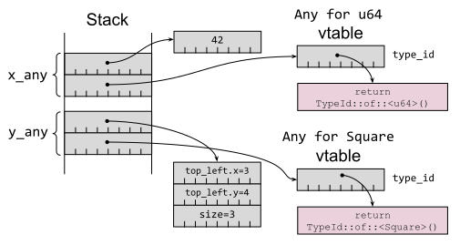

# 第 19 条：避免反射

从其他语言转向 Rust 的程序员通常习惯于将反射作为他们工具箱的一部分。他们会浪费大量时间尝试在 Rust 中实现基于反射的设计，结果他们会发现他们尝试做的事情即使能做成，也会很糟糕。本条希望通过描述 Rust 关于反射有的和没有的，以及可以用什么来代替，从而节省探索死胡同所浪费的时间。

*反射*是程序在运行时上检查自身的能力。给运行时丢一个数据，会有以下问题：

- 可以确定有关该数据的类型的哪些信息？
- 可以利用这些信息做什么？

具有完全反射支持的语言对这些问题有很多解答。具有反射的语言通常根据反射信息在运行时上支持以下或全部功能：

- 判断一个数据的类型
- 发掘其内容
- 更改其字段
- 调用其方法

具有这种程度的反射支持的语言也*往往*是动态类型语言（比如 [Python], Ruby），但是还有一些出名的静态类型语言也支持反射，特别是 [Java] 和 [Go]。

Rust 不支持这种类型的反射，这使得**避免反射**的建议在这种层次上非常容易实现——但其实是不可能的。对于来自完整支持反射的语言的程序员来说，乍一看，反射的缺席似乎是一个重大差距，但 Rust 的其他功能提供了许多解决相同问题的替代方法。

C++ 有一种有限制的反射，称为*运行时类型识别*（_run-time type identification_, RTTI）。[`typeid`] 操作符为*多态类型*的对象（大概是：有虚函数的类），返回每个类型的独一无二的标识符。

- `typeid`：可以通过基类引用来恢复对象的具体类
- [`dynamic_cast<T>`]：在安全且正确的情况下，允许将基类转换为派生类

Rust 也不支持这种 RTTI 风格的反射，延续了本条建议所遵循的主题。

Rust 确实支持一些在 [`std::any`] 模块中提供的*类似*功能特性，但它们功能受限（接下来将探索的）并且最好避免使用，除非没有其他代替方案。

`std::any` 中第一个类似反射的功能*乍一看*非常神奇——是一种确定数据类型名字的方法。以下示例使用了用户定义的 `tname()` 函数：

```rust
let x = 42u32;
let y = vec![3, 4, 2];
println!("x: {} = {}", tname(&x), x);
println!("y: {} = {:?}", tname(&y), y);
```

输出在值的旁边显示类型：

```
x: u32 = 42
y: alloc::vec::Vec<i32> = [3, 4, 2]
```

`tname()` 的实现揭示了编译器的秘密：这是一个泛型函数（根据[第 12 条]），所以实际上每次调用都会生成一个不同的函数（`tname::<u32>` 或 `tname::<Square>`）：

```rust
fn tname<T: ?Sized>(_v: &T) -> &'static str {
    std::any::type_name::<T>()
}
```

函数的实现由 [`std::any::type_name<T>`] 库函数提供，也是泛型函数。该函数只能访问*编译期*信息；没有代码在运行时来确定类型。[第 12 条]中返回到 trait 对象的类型证实了这一点：

```rust
let square = Square::new(1, 2, 2);
let draw: &dyn Draw = &square;
let shape: &dyn Shape = &square;

println!("square: {}", tname(&square));
println!("shape: {}", tname(&shape));
println!("draw: {}", tname(&draw));
```

只有 trait 对象的类型可用，而不是具体底层数据的类型（`Square`）：

```
square: reflection::Square
shape: &dyn reflection::Shape
draw: &dyn reflection::Draw
```

`type_name` 返回的字符串仅能用于诊断——它显然是一个“尽力了”的助手，其内容可能改变并且可能不唯一——所以**不要尝试解析 `type_name` 的结果**。如果你需要全局唯一的类型标识符，请使用 [`TypeId`] 代替：

```rust
use std::any::TypeId;

fn type_id<T: 'static + ?Sized>(_v: &T) -> TypeId {
    TypeId::of::<T>()
}
```

```rust
println!("x has {:?}", type_id(&x));
println!("y has {:?}", type_id(&y));
```

```
x has TypeId { t: 18349839772473174998 }
y has TypeId { t: 2366424454607613595 }
```

输出对人类来说是不可读的，但唯一性确保结果可以在代码中使用。但是，通常最好不要直接用 `TypeId`，而是使用 [`std::any::Any`] trait 来替代，因为标准库有用于处理 `Any` 实例的附加方法（如下）。

`Any` trait 有一个方法 [`type_id()`]，对实现了该 trait 的类型返回一个 `TypeId` 值。不过，你不能自行实现该 trait，因为 `Any` 已经为大多数任意类型 `T` 提供了全面的实现：

```rust
impl<T: 'static + ?Sized> Any for T {
    fn type_id(&self) -> TypeId {
        TypeId::of::<T>()
    }
}
```

这种一揽子实现并未覆盖*所有*类型 `T`：`T: 'static` *生命周期约束*意味着如果 `T` 包含任何具有非`'static` 生命周期的引用，那么 `TypeId` 就没有为 `T` 实现。这是[有意的限制](https://github.com/rust-lang/rust/issues/41875)，因为生命周期并不完全属于该类型：`TypdId::of::<&'a T>` 与 `TypeId::of::<&'b T>` 虽然是相同的，但他俩生命周期不同，这增加了混淆和不安全代码的可能性（译者注：意思是 `type_id()` 对他俩只会返回相同的 `TypeId`，但是他俩生命周期是不同的，生命周期不是类型的一部分，判断他俩的 `id` 会导致混淆并且不安全，所以要加限制为 `'static`）。

回想一下[第 8 条]，trait 对象是一个胖指针，存储了指向底层具体数据的指针，以及指向该 trait 实现的虚表的指针。对于 `Any`，虚表只有一个入点，即用于返回项目类型的 `type_id()` 方法，如图 3-4 所示：

```rust
let x_any: Box<dyn Any> = Box::new(42u64);
let y_any: Box<dyn Any> = Box::new(Square::new(3, 4, 3));
```



_图 3-4. `Any` trait 对象，每个都有指向具体数据以及虚表的指针_

除了一些间接寻址之外，一个 `dyn Any` trait 对象实际上就是一个裸指针和一个类型标识符的结合体。这意味着标准库可以为一个 `dyn Any` trait 对象提供一些附加的已定义的通用方法；这些方法对于某些附加类型 `T` 是通用的：

- [`is::<T>()`]：指示了 trait 对象是否等于某个特定的其他类型 `T`
- [`downcast_ref::<T>()`]：返回对具体类型 `T` 的引用，前提是 trait 对象的类型与 `T` 匹配
- [`downcast_mut::<T>()`]：返回对具体类型 `T` 的可变引用，前提是 trait 对象的类型与 `T` 匹配

你会发现 `Any` trait 只是近似反射的功能：语法选择了（在编译时）显式构建一些东西（`&dyn Any`）来跟踪该数据的编译时类型以及位置。仅当构建 `Any` trait 对象的开销已经发生时，（比如）向下转型回原始类型的能力才是可能的。

Rust 中很少有场景会在一个数据上关联不同的编译时类型和运行时类型。其中最主要的就是 _trait objects_：具体类型为 `Square` 的数据可以被强制转换为该类型实现的 trait 对象 `dyn Shape`。这种强制是从一个简单的指针（对象/数据）构建了一个胖指针（对象 + 虚表）。

回想[第 12 条]，Rust 的 trait 对象并不是真正面向对象的。`Square` 并不是一个 `Shape`；只是 `Square` 实现了 `Shape` 的接口。对于 trait 约束也是如此：一个 trait 约束 `Shape: Draw` 并不意味着 _is-a_；这只意味着*也实现了*，因为 `Shape` 的虚表包含了 `Draw` 的方法的入点。

对于一些简单的 trait 约束：

```rust
trait Draw: Debug {
    fn bounds(&self) -> Bounds;
}

trait Shape: Draw {
    fn render_in(&self, bounds: Bounds);
    fn render(&self) {
        self.render_in(overlap(SCREEN_BOUNDS, self.bounds()));
    }
}
```

等效的 trait 对象：

```rust
let square = Square::new(1, 2, 2);
let draw: &dyn Draw = &square;
let shape: &dyn Shape = &square;
```

带有箭头的图片（如图 3-5；与[第 12 条]重复）使问题变得清晰明了；给定一个 `dyn Shape` 对象，没有直接的方法来构建 `dyn Draw` trait 对象，因为没有方法变回 `impl Draw for Square` 的虚表——即使其内容的相关部分（`Square::bounds()` 方法的地址）理论上*是*可以恢复的。（这可能在 Rust 的更高版本中发生变化；请参阅本条最后部分。）


_图 3-5. 用于 trait 约束的 trait 对象，用于 `Draw` 和 `Shape` 的不同虚表_

与上图对比，显然，显式构造的 `&dyn Any` trait 对象没有用处。`Any` 允许恢复底层数据的具体类型，但没有方法可以查看它实现了哪些 trait，或者访问可能允许创建的 trait 对象的相关虚表。

那么可以用什么来替代呢？

最主要的工具是 trait 定义，这与其他语言的建议一致——*Effective Java*第 65 条建议，“接口比反射更好”。如果代码需要依赖于某个数据的某些行为的可用性，请为该行为编写一个 trait（[第 2 条]）。即使所需的行为无法表达为一组方法签名，也可以使用标记 trait 来表明所需行为所需的遵守，这比（例如）检查类名的特定前缀更安全且高效。

需要 trait 对象的代码也可以用于哪些在程序链接时尚未提供支持代码的对象，因为这些代码是在运行时动态加载的（通过 `dlopen(3)` 或类似方法）——这意味着范型的单态化([第 2 条])是不可能的。

相关地，反射有时也被用在其他语言中，以允许同一依赖库的多个不兼容版本一次加载到程序中，绕过“只能有一个”的链接约束。这在 Rust 中是不需要的，因为 Cargo 已经可以处理同一个库的多个版本（[第 25 条]）。

最后，宏——尤其是 `derive` 宏——可以被用于自动生成在编译期了解数据类型的代码，作为一种更高效、更类型安全的等效代码，相当于在运行时解析数据内容的代码。[第 28 条]讨论了 Rust 的宏系统。

## Rust 未来版本中的向上转型

本条的文本首次于 2021 年编写，期间是一直保持准确的，直到本书准备于 2024 年出版——此时 Rust 将会添加一个新功能，该功能会更改一些细节。

[新的“trait 向上转型”功能](https://github.com/rust-lang/rust/issues/65991)，当 `U` 是 `T` 的父 trait 时（`trait T: U {...}`），可以将 trait 对象 `dyn T` 向上转型为 `dyn U`。该功能在正式发布前已在 `#![feature(trait_upcasting)]` 开启，预计在 Rust 1.76 版本。

对于之前的示例，这意味着 `&dyn Shape` trait 对象*可以*被转型为 `&dyn Draw` trait 对象，更接近于 [Liskov 替换](https://en.wikipedia.org/wiki/Liskov_substitution_principle)原则中的 _is-a_ 关系。允许这种转换会对虚表实现的内部细节产生连锁反应，它们可能会变得比上图所示的版本更复杂。

然而，该数据的核心不受影响——`Any` trait 没有父 trait，所以其向上转型的能力不会增加任何功能。

原文[点这里](https://www.lurklurk.org/effective-rust/reflection.html)查看

<!-- 参考链接 -->

[第 2 条]: https://www.lurklurk.org/effective-rust/use-types-2.html
[第 8 条]: https://www.lurklurk.org/effective-rust/references.html
[第 12 条]: https://www.lurklurk.org/effective-rust/generics.html
[第 25 条]: https://www.lurklurk.org/effective-rust/dep-graph.html
[第 28 条]: https://www.lurklurk.org/effective-rust/macros.html
[Python]: https://docs.python.org/3/library/types.html#module-types
[Java]: https://docs.oracle.com/javase/8/docs/api/java/lang/reflect/package-summary.html
[Go]: https://golang.org/pkg/reflect/
[`typeid`]: https://en.cppreference.com/w/cpp/language/typeid
[`dynamic_cast<T>`]: https://en.cppreference.com/w/cpp/language/dynamic_cast
[`std::any`]: https://doc.rust-lang.org/std/any/index.html
[`std::any::type_name<T>`]: https://doc.rust-lang.org/std/any/fn.type_name.html
[`std::any::Any`]: https://doc.rust-lang.org/std/any/trait.Any.html
[`is::<T>()`]: https://doc.rust-lang.org/std/any/trait.Any.html#method.is
[`downcast_ref::<T>()`]: https://doc.rust-lang.org/std/any/trait.Any.html#method.downcast_ref
[`downcast_mut::<T>()`]: https://doc.rust-lang.org/std/any/trait.Any.html#method.downcast_mut
